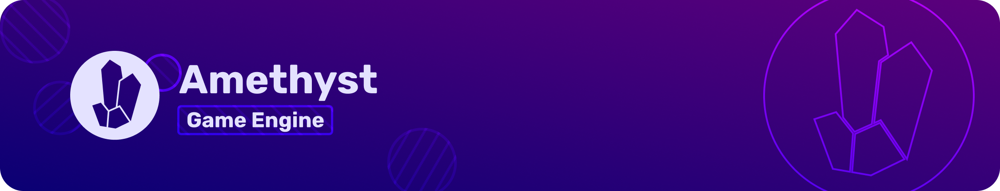

[![Build Status][s1]][ac] [![Crates.io][s2]][ci] [![docs page][docs-badge]][docs] [![MIT/Apache][s3]][li]
[![Join us on Discord][s4]][di] [![Community forum][s5]][ds] [![Reddit][s7]][rd]
[![Code coverage][s8]][cc] ![Lines of Code][s6]

## What is Amethyst?

Amethyst is a data-driven and data-oriented game engine aiming to be fast and as configurable as possible.

## Principles

These principles are what makes Amethyst unique and competitive in the world of game engines:

- Massively parallel architecture.
- Powered by a correct [Entity Component System][ecs] model.
- Rapid prototyping with [RON] files for prefabs and an abstract scripting API.
- Strong focus on encouraging reusability and clean interfaces.

## Why Amethyst?

### Extreme Multithreading

Amethyst is based over a very powerful parallel [ECS] called Specs. This allows games built with Amethyst to maximize the available processing power to run as smoothly and as quickly as possible, without the headaches of multi-threaded programming.

### Clean

By design, the Amethyst engine encourages you to write clean and reusable code for your behaviours and data structures. This allows engine users to easily share useful components, thus reducing development time and cost.

Using the [ECS] architecture, the code of games can be cleanly divided between data and behaviour, making it easy to understand what is going on, even if the game is running on a massive 64-core processor.

### Community

- [Discord](https://discord.gg/amethyst) - Announcements, help, useful information, general discussion.

## Features

Please visit the [features page][feat] for a list of features Amethyst provides.

## Navigation

- [**Link to the book (master)**][bkm]
- [**Link to the book (0.15)**][bkstable]
- [**Link to the book (0.14)**][bks14]
- [**Link to the examples (master)**][exm]
- [**Link to the examples (0.15)**][ex15]
- [**Link to the examples (0.14)**][ex14]

## Usage

While the engine can be hard to use at times, we made a lot of [documentation][bkstable] that will teach you everything you need to use Amethyst comfortably.

If you don't understand a part of the documentation, please let us know. Join us on Discord or open an issue; we are always happy to help!

## Getting started

### Before you begin

This repository uses Git LFS for some files used in examples.
If you intend to run the examples, make sure you have LFS installed in your system before you clone.
You can download it and read the installation instructions at [Git LFS home page](https://git-lfs.github.com/).

### Examples

To compile any of the examples run:

```shell
$ cargo run -p name_of_example
```

All available examples are listed under the [examples][exm] directory.

For a full-blown "Hello World" tutorial check out the [Getting Started][gs] chapter in the book.

### Showcase games

Our official showcase games demonstrate larger, continuously developed game projects made with Amethyst:

- [Evoli] - 3D, ecosystem simulator
- [Space Menace][menace] - 2D, action platformer

For more examples see [Games Made With Amethyst][gmwa] topic on the community forum for some good sources of inspiration.

## Dependencies

If you are compiling on Linux, make sure to install the dependencies below.

### Arch Linux

```sh
pacman -Syu grep gcc pkgconf openssl alsa-lib cmake make python3 freetype2 awk libxcb
```

### Debian/Ubuntu

```sh
apt install gcc pkg-config openssl libasound2-dev cmake build-essential python3 libfreetype6-dev libexpat1-dev libxcb-composite0-dev libssl-dev libx11-dev libfontconfig1-dev
```

### Fedora

```sh
dnf install pkgconfig gcc openssl-devel alsa-lib-devel cmake make gcc-c++ freetype-devel expat-devel libxcb-devel libX11-devel
```

### openSUSE

```sh
zypper install gcc pkg-config libopenssl-devel alsa-devel cmake gcc-c++ python3 freetype2-devel libexpat-devel libxcb-devel
```

### Nix/NixOS

In your project's root folder, create a file `shell.nix` with the following contents:

```nix
let
  mozilla = import (builtins.fetchTarball https://github.com/mozilla/nixpkgs-mozilla/archive/master.tar.gz);
  nixpkgs = import <nixpkgs> { overlays = [ mozilla ]; };
in

  with nixpkgs;

  mkShell {
    buildInputs = [
      alsaLib
      cmake
      freetype
      latest.rustChannels.stable.rust
      expat
      openssl
      pkgconfig
      python3
      vulkan-validation-layers
      xlibs.libX11
    ];

    APPEND_LIBRARY_PATH = stdenv.lib.makeLibraryPath [
      vulkan-loader
      xlibs.libXcursor
      xlibs.libXi
      xlibs.libXrandr
    ];

    shellHook = ''
      export LD_LIBRARY_PATH="$LD_LIBRARY_PATH:$APPEND_LIBRARY_PATH"
    '';
  }
```

### Other

See your distribution-specific installation process for the equivalent dependencies.

**Please note that you need to have a functional graphics driver installed. If you get a panic about the renderer unable to create the context when trying to run an example, a faulty driver installation could be the issue.**

## Building Documentation

You can build the book locally with:

```sh
cargo install mdbook
mdbook build book
```

If you're actively editing the book, it's easiest to run:

```shell
mdbook serve book
```

and navigate to `http://localhost:3000`. The text itself can be found in `book/html/index.html`. For more information, please see the [mdBook project](https://github.com/rust-lang-nursery/mdBook).

To generate the API documentation locally, do:

```shell
$ cargo doc
```

The API reference can be found in `target/doc/amethyst/index.html`.

## Questions/Help

Amethyst supports _only_ the latest stable release of Rust. Use the nightly and beta channels with this project at your own risk.

If you have a question, please check out the [FAQ] before asking. Chances are, the solution to your problem is already present there. If you still need help, feel free to ask on our [Discord server][di].

Other places you might want to check out are [r/rust\_gamedev][rg] and the [#rust-gamedev IRC][irc].

## Contributing

**Note:** Any interaction with the Amethyst project is subject to our [Code of Conduct](https://github.com/amethyst/amethyst/blob/master/CODE_OF_CONDUCT.md).

Amethyst is a community-based project that welcomes contributions from anyone. If you're interested in helping out, please read the [contribution guidelines][cm] before getting started.

We have a [good first issue][gfi] category that groups all issues or feature requests that can be made without having an extensive knowledge of Rust or Amethyst. Working on those issues is a good, if not the best, way to learn.

If you think you are not ready to code yet, you can still contribute by reviewing code written by other members of the community. Code reviews ensure that code merged into Amethyst is of the highest quality as possible. Pull requests that are available for reviews can be found [here][pr].

If for some reason we don't have any open PRs in need of a review nor any good first issues (that would be a good thing), feel free to consult our [issue tracker][it].

## Backers

Thank you to all our backers! 🙏 [Become a backer](https://amethyst.rs/donate)

## Sponsors

Amethyst is supported by:

<p>
  <a href="https://www.digitalocean.com?utm_medium=opensource&utm_source=amethyst/">
    
  </a>
</p>
<p>
  <a href="http://embark-studios.com">
    
  </a>
</p>

## License

Amethyst is free and open source software distributed under the terms of both the [MIT License][lm] and the [Apache License 2.0][la].

Unless you explicitly state otherwise, any contribution intentionally submitted for inclusion in the work by you, as defined in the Apache-2.0 license, shall be dual licensed as above, without any additional terms or conditions.

[ac]: https://github.com/amethyst/amethyst/actions
[bkm]: https://book.amethyst.rs/master/
[bks14]: https://book.amethyst.rs/v0.14.0/
[bkstable]: https://book.amethyst.rs/stable/
[cc]: https://codecov.io/gh/amethyst/amethyst
[ci]: https://crates.io/crates/amethyst/
[cm]: docs/CONTRIBUTING.md
[di]: https://discord.gg/amethyst
[docs]: https://amethyst.rs/doc/
[docs-badge]: https://img.shields.io/badge/docs-website-blue.svg
[ds]: https://community.amethyst.rs/
[ecs]: https://en.wikipedia.org/wiki/Entity%E2%80%93component%E2%80%93system
[evoli]: https://github.com/amethyst/evoli
[ex14]: https://github.com/amethyst/amethyst/tree/v0.14.0/examples
[ex15]: https://github.com/amethyst/amethyst/tree/v0.15.0/examples
[exm]: https://github.com/amethyst/amethyst/tree/master/examples
[faq]: https://github.com/amethyst/amethyst/wiki/Frequently-Asked-Questions
[feat]: docs/FEATURES.md
[gfi]: https://github.com/amethyst/amethyst/issues?q=is%3Aissue+is%3Aopen+label%3A%22good+first+issue%22
[gmwa]: https://community.amethyst.rs/t/games-made-with-amethyst/134
[gs]: https://book.amethyst.rs/stable/getting-started.html
[irc]: https://botbot.me/mozilla/rust-gamedev/
[it]: https://github.com/amethyst/amethyst/issues
[la]: docs/LICENSE-APACHE
[li]: COPYING
[lm]: docs/LICENSE-MIT
[menace]: https://github.com/amethyst/space-menace
[pr]: https://github.com/amethyst/amethyst/pulls
[rd]: https://www.reddit.com/r/Amethyst/
[rg]: https://www.reddit.com/r/rust_gamedev/
[ron]: https://github.com/ron-rs/ron
[s1]: https://github.com/amethyst/amethyst/workflows/CI/badge.svg
[s2]: https://img.shields.io/crates/v/amethyst.svg
[s3]: https://img.shields.io/badge/license-MIT%2FApache-blue.svg
[s4]: https://img.shields.io/discord/425678876929163284.svg?logo=discord
[s5]: https://img.shields.io/badge/discourse-online-green.svg
[s6]: https://tokei.rs/b1/github/amethyst/amethyst?category=code
[s7]: https://img.shields.io/badge/dynamic/json.svg?label=r/Amethyst&query=%24.data.subscribers&url=https://www.reddit.com/r/Amethyst/about.json
[s8]: https://img.shields.io/codecov/c/github/amethyst/amethyst.svg
