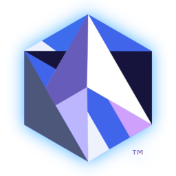

# Amethyst

[![Build Status][s1]][tc] [![Crates.io][s2]][ci] [![MIT/Apache][s3]][li] [![Join the chat][s4]][gc] [![Join us on Discord][s5]][di] ![Lines of Code][s6]

[s1]: https://travis-ci.org/amethyst/amethyst.svg?branch=master
[s2]: https://img.shields.io/crates/v/amethyst.svg
[s3]: https://img.shields.io/badge/license-MIT%2FApache-blue.svg
[s4]: https://badges.gitter.im/amethyst/general.svg
[s5]: https://img.shields.io/discord/425678876929163284.svg?logo=discord
[s6]: https://tokei.rs/b1/github/amethyst/amethyst?category=code
[tc]: https://travis-ci.org/amethyst/amethyst/
[ci]: https://crates.io/crates/amethyst/
[li]: COPYING
[gc]: https://gitter.im/orgs/amethyst/rooms
[di]: https://discord.gg/GnP5Whs

## What is Amethyst?!

Amethyst is a game engine aiming to be fast and as configurable as possible.

## Principles

These principles are what make amethyst unique and competitive in the world of game engines.

* Massively parallel architecture.
* Powered by a correct [Entity Component System][ecs] model.
* Rapid prototyping with [RON](Json-like) files for prefabs and an abstract scripting API.
* Strong focus on encouraging reusability and clean interfaces.

[ecs]: https://en.wikipedia.org/wiki/Entity–component–system
[ron]: https://github.com/ron-rs/ron

## Why Amethyst?

### Extreme Multithreading

Amethyst is based over a very powerful parallel [ecs] called specs.
This allows games built with Amethyst to maximize the processing power usage to make it run as smooth and as fast as possible, without the headache of multithread programming.

### Clean

By design, the amethyst engine encourages you to write clean and reusable code for your behaviours and data structures, allowing engine users to easily
share useful components, thus reducing development time and cost.

Using the [ecs] architecture, the code of games can be cleanly divided between data and behaviour, making it easy to understand what is going on,
even if the game is running on a massive 64 cores processor.

### Community

While we may not be feature-packed (yet!), we all strongly believe that the community-oriented side of amethyst will thrive as we move forward!

## Features

Please visit the [features page][feat] for a list of features Amethyst provides.

[feat]: docs/FEATURES.md

## Documentation

[![develop docs][adb1]][ad1] [![master docs][adb2]][ad2]

[adb1]: https://img.shields.io/badge/docs-develop-blue.svg
[adb2]: https://img.shields.io/badge/docs-master-blue.svg
[ad1]: https://www.amethyst.rs/doc/develop.html
[ad2]: https://www.amethyst.rs/doc/master.html

## Usage

While the engine can be hard to use at times, we made a lot of [documentation][bk] that will teach you everything you need to use amethyst comfortably!

If you don't understand a part of the documentation, please let us know. Join us on discord or gitter, or open an issue, we are always happy to help!

[bk]: https://www.amethyst.rs/book/master/

## Getting started

To compile any of the examples run:

```
$ cargo run --example name_of_example
```

All available examples are listed under [examples][ex].

Our most advanced example is currently called pong. It is a pong game, as you may have guessed it.

```
$ cargo run --example pong
```

There are quite a few prototype games that were made with Amethyst. A list will be available soon.
While we create this list, feel free to join our discord and ask about which projects are currently being made with Amethyst.

For a full-blown "Hello World" tutorial check out the [Getting Started][gs] chapter
in the book.

[ex]: examples/
[gs]: https://www.amethyst.rs/book/master/getting_started.html

## Dependencies

If you are compiling on Linux make sure to install the following dependencies:

### Ubuntu

```
$ sudo apt install libasound2-dev libx11-xcb-dev
```

### Fedora

```
$ sudo dnf install alsa-lib-devel
```

## Building Documentation

You can build the book locally with:

```
$ cargo install mdbook
$ mdbook build book
```

If you're actively editing the documentation, it's easiest to run:

```
$ mdbook serve book
```

and go to `http://localhost:3000`. For more information, see the [mdBook project](https://github.com/rust-lang-nursery/mdBook).

The text can be found in `book/html/index.html`. To generate the API
documentation locally, do:

```
$ cargo doc
```

The API reference can be found in `target/doc/amethyst/index.html`.

## Questions / Help

We do not support anything other than the most recent Rust stable release. Use nightly and beta channels with this project at your own risk.

Please check out the [FAQ][faq] before asking.

If you have a question, just ask on [Discord][di] (most active) or [Gitter][gt] and we'll help you.

Other places you may want to check out are [r/rust_gamedev][rg] and [#rust-gamedev IRC][irc].

[faq]: https://github.com/amethyst/amethyst/wiki/Frequently-Asked-Questions
[gt]: https://gitter.im/amethyst/general
[di]: https://discord.gg/GnP5Whs
[rg]: https://www.reddit.com/r/rust_gamedev/
[irc]: https://botbot.me/mozilla/rust-gamedev/

## Contributing

We are a community project that welcomes contributions from anyone.

If you're interested in helping out, please read the [contribution guidelines][cm]
file before getting started.

We have a [good first issue][gfi] category that groups all issues or feature request
that can be made without having an extensive knowledge of rust or amethyst.
Working on those issues is a good, if not the best way to learn.

If you think you are not ready to code yet, you can still contribute by reviewing code written by other members of the community.
In fact, code reviews ensures that the code that gets added to amethyst is of the highest quality as possible.
Pull requests available for reviews are [here][pr].

If for some reason we don't have any open PR or good first issues (that would be a good thing),
you can look through the [issue tracker][it].

[cm]: docs/CONTRIBUTING.md
[pr]: https://github.com/amethyst/amethyst/projects
[it]: https://github.com/amethyst/amethyst/issues
[gfi]: https://github.com/amethyst/amethyst/issues?q=is%3Aissue+is%3Aopen+label%3A%22good+first+issue%22

## License

Amethyst is free and open source software distributed under the terms of both
the [MIT License][lm] and the [Apache License 2.0][la].

[lm]: docs/LICENSE-MIT
[la]: docs/LICENSE-APACHE

Unless you explicitly state otherwise, any contribution intentionally submitted
for inclusion in the work by you, as defined in the Apache-2.0 license, shall be
dual licensed as above, without any additional terms or conditions.
