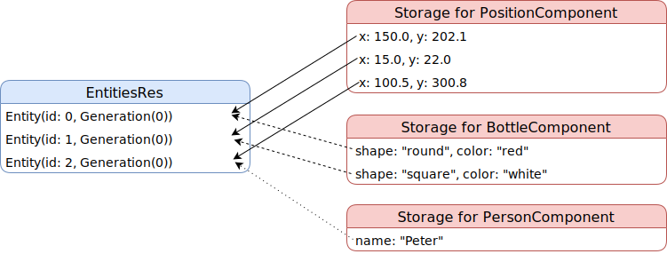

# Entity and Component

## What are `Entity` and `Component`?

An `Entity` represents a single object in your world. `Component` represents one aspect of an object. For example, a bottle of water has a shape, a volume, a color and is made of a material (usually plastic). In this example, the bottle is the entity, and the properties are components.

## Entity and Component in Amethyst

In an inheritance design, entity usually contains components. All the data and methods related to an entity are stored within. However, in the ECS design, entity is just a general purpose object. In fact, the implementation of `Entity` in Amethyst is simply:

```rust,ignore
struct Entity(u32, Generation);
```

where u32 is the id of the entity and generation is used to check if the entity has been deleted.

`Entity`s are stored in a special container `EntitiesRes`. Whereas the data associated with the entities are grouped into components and stored in the designated storages.

Consider an example where you have three objects: two bottles and a person.

|  object  |   x   |   y   |   shape  |  color  |   name  |
|:--------:|:-----:|:-----:|:--------:|:-------:|:-------:|
| Bottle A | 150.0 | 202.1 |  "round" |  "red"  |         |
| Bottle B | 570.0 | 122.0 | "square" | "white" |         |
| Person C | 100.5 | 300.8 |          |         | "Peter" |

We can separate bottle's properties into `PositionComponent` and `BottleComponent`, and person's properties into `PositionComponent` and `PersonComponent`. Here's an illustration of how the three objects would be stored.



As you could see from the graph, entities do not store data. Nor do they know any information about their components. They serve the purpose of object identification and tracking object existence. The component storage stores all the data and their connection to entities.

If you are familiar with relational databases, this organization looks quite similar to the tables in a database, where entity id serves as the key in each table. In fact, you can even join components or entities like joining tables. For example, to update the position of all the persons, you will need to join the `PersonComponent` and the `PositionComponent`. 

## EntitiesRes

Even though the structure of the entity is pretty simple, entity manipulation is very sophisticated and crucial to game performance. This is why entities are handled exclusively by the struct `EntitiesRes`. `EntitiesRes` provides two ways for creating/deleting entities:

* Immediate creation/deletion, used for game setup or clean up.
* Lazy creation/deletion, used in the game play state. It updates entities in batch at the end of each game loop. This is also referred to as atomic creation/deletion.

You will see how these methods are used in later chapters.

## Declaring a component

To declare a component, you first declare the relevant underlying data:

```rust,edition2018,no_run,noplaypen
# extern crate amethyst;
# use amethyst::core::nalgebra::{Isometry3, Vector3};

/// This `Component` describes the shape of an `Entity`
enum Shape {
    Sphere { radius: f32 },
    Cuboid { height: f32, width: f32, depth: f32 },
}

/// This `Component` describes the transform of an `Entity`
pub struct Transform {
    /// Translation + rotation value
    iso: Isometry3<f32>,
    /// Scale vector
    scale: Vector3<f32>,
}
```

and then you implement the `Component` trait for them:

```rust,edition2018,no_run,noplaypen
# extern crate amethyst;
# struct Shape;
# struct Transform;
use amethyst::ecs::{Component, DenseVecStorage, FlaggedStorage};

impl Component for Shape {
    type Storage = DenseVecStorage<Self>;
}

impl Component for Transform {
    type Storage = FlaggedStorage<Self, DenseVecStorage<Self>>;
}
```

The storage type will determine how you store the component, but it will not initialize the storage. Storage is initialized when you register a component in `World` or when you use that component in a `System`.

## Storages

There are a few storage strategies for different usage scenarios. The most commonly used types are `DenseVecStorage`, `VecStorage` and `FlaggedStorage`.

* `DenseVecStorage`: Elements are stored in a contiguous vector. No empty space is left between `Component`s, allowing a lowered memory usage for big components.
* `VecStorage`: Elements are stored into a sparse array. The entity id is the same as the index of component. If your component is small (<= 16 bytes) or is carried by most entities, this is preferable over `DenseVecStorage`.
* `FlaggedStorage`: Used to keep track of changes of a component. Useful for caching purposes.


For more information, see the [specs storage reference](https://docs.rs/specs/latest/specs/storage/index.html)
and the ["Storages" section](https://slide-rs.github.io/specs/05_storages.html) of the specs book.

There are a bunch more storages, and deciding which one is the best isn't trivial and should be done based on careful benchmarking. A general rule is: if your component is used in over 30% of entities, use `VecStorage`. If you don't know which one you should use, `DenseVecStorage` is a good default. It will need more memory than `VecStorage` for pointer-sized components, but it will perform well for most scenarios.

## Tags

Components can also be used to "tag" entities.
The usual way to do it is to create an empty struct, and implement `Component` using `NullStorage` as the `Storage` type for it.
Null storage means that it is not going to take memory space to store those components.

You will learn how to use those tag components in the System chapter.