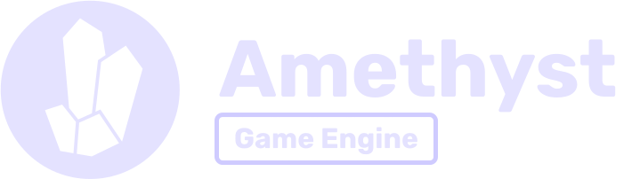

   

## Presentation

Howdy! This book will teach you everything you need to know about building video
games and interactive simulations with the Amethyst game engine. This engine is
written entirely in [Rust][rs], a safe and fast systems programming language,
and sports a clean and modern design. More correctly, though, Amethyst is
actually a collection of separate libraries and tools that collectively make up a
game engine.

[rs]: https://www.rust-lang.org/

Amethyst is free and open source software, distributed under a dual license of [MIT][ml]
and [Apache][al]. This means that the engine is given to you at no cost
and its source code is completely yours to tinker with. The code is available on
[GitHub][am]. Contributions and feature requests will always be welcomed!

[ml]: https://github.com/amethyst/amethyst/blob/master/docs/LICENSE-MIT
[al]: https://github.com/amethyst/amethyst/blob/master/docs/LICENSE-APACHE
[am]: https://github.com/amethyst/amethyst/tree/master

## Getting started

This book is split into several sections, with this introduction being the first. The others are:

- [Getting Started][gs] – Prepare your computer for Amethyst development.
- [Concepts][cc] – An overview of the concepts used in Amethyst. Recommended.
- [Pong Tutorial][pt] – Build a basic pong game in Rust.
- [Math][math] – A quick introduction to doing math with Amethyst.
- [Animation][anim] – Explains the architecture of the `amethyst_animation` crate.
- [Controlling `System` Execution][cse] – Shows you how to structure more complex games that need to change the `System` graph.
- [Glossary][gl] – Defines special terms used throughout the book.
- [Appendix A: Config Files][ax_a] – Shows you how to define your data in RON files.

[gs]: ./getting-started.html
[cc]: ./concepts/intro.html
[pt]: ./pong-tutorial.html
[math]: ./math.html
[anim]: ./animation.html
[cse]: ./controlling_system_execution.html
[gl]: ./glossary.html
[ax_a]: ./appendices/a_config_files.html

Read the crate-level [API documentation][ad] for more details.

[ad]: https://docs.amethyst.rs/stable/amethyst/index.html
[db]: https://github.com/amethyst/amethyst/

## Motivation

Most of us have worked with quite a few game engines over the years, namely [Unity][un], [Unreal Engine][ud], [JMonkeyEngine][jme] and many more.
While they all are pretty solid solutions if you want to
build a quality game, each have their own pros and cons that you have to
weigh before using them, especially in regards to performance and scalability.

[un]: http://unity3d.com/
[ud]: https://www.unrealengine.com/
[jme]: http://jmonkeyengine.org/

We think that basing the Amethyst engine on good and modern principles will allow us to make an open source game engine that can actually be more performant than those engines.
Those principles are:

1. Modularity.

   Modularity is at the core of the [Unix philosophy][up], which proved itself to be an excellent way of developing software over the years.
   You will always be free to use the built-in modules, or to write your own and integrate them easily into the engine.
   Since modules are small and well integrated, it is easier to reason about what they do and how they relate to other modules.

2. Parallelism.

   Modern computers, even cheap ones, all have multithreading with multicore CPUs. We expect that over the years, there will be more and more opportunities for parallelism to improve performance.
   With a proper parallel engine, we are convinced that your game will be more and more performant over the years without even needing you to update it.

3. Data-oriented/Data-driven.

   Building your game around the data makes it really easy to prototype and quickly build a game.
   Complex behaviours like swapping assets during gameplay become a breeze, making testing and balancing a lot faster.

[up]: https://en.wikipedia.org/wiki/Unix_philosophy

## Why use Amethyst?

While there are a lot of [great building blocks][awg] in the Rust ecosystem, using the Amethyst engine instead of building your own game engine definitely has a lot of advantages.

First of all, the engine is based on the [Specs][specs] library, which is a common base on which the engine's concepts are built. For a great introduction to game development with Rust and an Entity Component System, see this [great talk by Catherine West](https://kyren.github.io/2018/09/14/rustconf-talk.html). Amethyst's take on ECS is described in the [concepts](./concepts/intro.md) section of the book.
A lot of features have been glued together using those:

There are the obvious ones:

- Transformations
- Graphics
- Windowing
- Inputs
- Audio
- Etc...

And also the less known but also essential features:

- Animations
- Gltf
- Locales
- Networking

If you were not to use Amethyst, not only would you need to create all those features (or use pre-existing crates), but you would also need to glue the layers together.

Amethyst does all of this for you, so that you can focus on making your game instead of worrying about the low-level details.

Futhermore, because of the architecture of Amethyst, almost all the parts are both configurable and replaceable. This means that if you do want to change something to suit your needs, there's always a way to do it.

For example, the [rodio](https://github.com/tomaka/rodio) crate is currently used for the audio features in the engine, but if you would rather use something more complex or a custom solution, all you have to do is add some glue that moves the data coming from Specs into the library that you are using to play and control the audio, without even having to touch the engine code!

[awg]: http://arewegameyet.com/
[specs]: https://github.com/slide-rs/specs

## Contributing

We are always happy to welcome new contributors!

To know where to start, we suggest you read our [contribution guidelines](https://github.com/amethyst/amethyst/blob/master/docs/CONTRIBUTING.md)

If you want to contribute, or have questions, let us know either on [GitHub][db], or on [Discord][di].

[di]: https://discord.gg/amethyst
