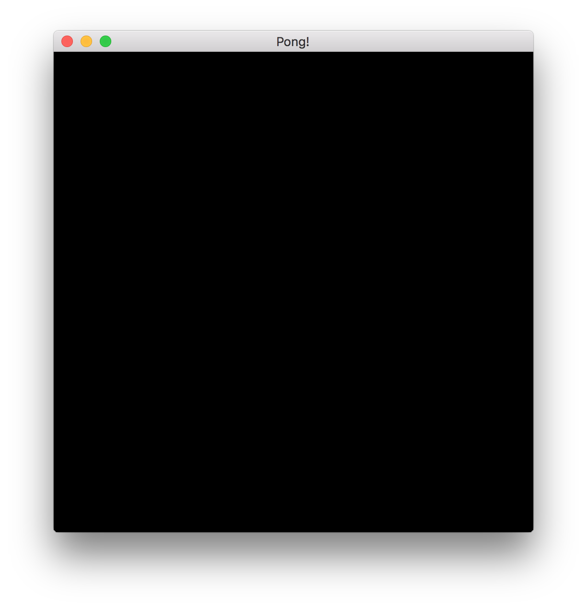

# Setting up the project

In this chapter, we will go through the basics of setting up the amethyst project,
starting the logger, opening a window and preparing a simple rendering setup.

## Creating a new project

Let's start a new project:

`cargo new pong`

Update the dependencies in the project's `Cargo.toml` so that it contains:

```toml
[package]
name = "pong"
version = "0.1.0"
authors = []
edition = "2018"

[dependencies.amethyst]
version = "0.15"
features = ["vulkan"]
```

Alternatively, if you are developing on macOS, you might want to use the `metal` rendering backend instead of `vulkan`. In this case, you should change the `features` entry in the `amethyst` dependency table.

```toml
[dependencies.amethyst]
version = "0.15"
features = ["metal"]
```

We can start with editing the `main.rs` file inside `src` directory.
You can delete everything in that file, then add these imports:

```rust
//! Pong Tutorial 1

use amethyst::{
    prelude::*,
    renderer::{
        plugins::{RenderFlat2D, RenderToWindow},
        types::DefaultBackend,
        RenderingBundle,
    },
    utils::application_root_dir,
};
```

We'll be learning more about these as we go through this tutorial. The prelude
includes the basic (and most important) types like `Application`, `World`, and
`State`. We also import all the necessary types to define a basic rendering pipeline.

Now we have all the dependencies installed and imports prepared, we are ready to start
working on defining our game code.

## Creating the game state

Now we create our core game struct:

```rust
pub struct Pong;
```

We'll be implementing the [`SimpleState`][simplestate] trait on this struct, which is
used by Amethyst's state machine to start, stop, and update the game.

```rust
impl SimpleState for Pong {}
```

Implementing the `SimpleState` teaches our application what to do when a close signal
is received from your operating system. This happens when you press the close
button in your graphical environment. This allows the application to quit as needed.

Now that our `Pong` is already a game state, let's add some code to actually get things
started! We'll start with our `main()` function, and we'll have it return a
`Result` so that we can use `?`. This will allow us to automatically exit
if any errors occur during setup.

```rust
# use amethyst::prelude::*;
fn main() -> amethyst::Result<()> {
    // We'll put the rest of the code here.

    Ok(())
}
```

> **Note:** The [SimpleState] is just a simplified version of [State] trait.
> It already implements a bunch of stuff for us, like the `State`'s `update`
> and `handle_event` methods that you would have to implement yourself were you
> using a regular `State`. Its behavior mostly cares about handling the exit signal cleanly,
> by quitting the application directly from the current state.

## Setting up the logger

Inside `main()` we first start the amethyst logger with a default `LoggerConfig`
so we can see errors, warnings and debug messages while the program is running.

```rust
# fn main() {
    amethyst::start_logger(Default::default());
# }
```

From now on, every info, warning, and error will be present and clearly formatted
inside your terminal window.

> **Note:** There are many ways to configure that logger, for example, to write the
> log to the filesystem. You can find more information about how to do that in [Logger API
> reference][log].
> We will use the most basic setup in this tutorial for simplicity.

## Preparing the display config

Next, we need to create a `DisplayConfig` to store the configuration for our game's
window. We can either define the configuration in our code or better yet load it
from a file. The latter approach is handier, as it allows us to change configuration
(e.g, the window size) without having to recompile our game every time.

Starting the project with `amethyst new` should have automatically generated
`DisplayConfig` data in `config/display.ron`. If you created the
project manually, go ahead and create it now.

In either case, open `display.ron` and change its contents to the
following:

```rust
(
    title: "Pong!",
    dimensions: Some((500, 500)),
)
```

> **Note:** If you have never run into Rusty Object Notation before (or RON for short),
> it is a data storage format that mirrors Rust's syntax. Here, the
> data represents the [`DisplayConfig`][displayconf] struct. If you want to
> learn more about the RON syntax, you can visit the [official repository][ron].

This will set the default window dimensions to 500 x 500, and make the title bar
say "Pong!" instead of the sad, lowercase default of "pong".

In `main()` in `main.rs`, we will prepare the path to a file containing
the display configuration:

```rust
# use amethyst::{utils::application_root_dir, Error};
# 
# fn main() -> Result<(), Error> {
    let app_root = application_root_dir()?;
    let display_config_path = app_root.join("config").join("display.ron");
#   Ok(())
# }
```

## Creating an application

In `main()` in `main.rs` we are going to add the basic application setup:

```rust
# use amethyst::{prelude::*, utils::application_root_dir};
# fn main() -> Result<(), amethyst::Error> {
#   struct Pong;
#   impl SimpleState for Pong {}
    let game_data = DispatcherBuilder::default();

#   let app_root = application_root_dir()?;
    let assets_dir = app_root.join("assets");
    let mut game = Application::new(assets_dir, Pong, game_data)?;
    //game.run();
#   Ok(())
# }
```

Here we're creating a new instance of `DispatcherBuilder`, a central repository
of all the game logic that runs periodically during the game runtime. Right now it's empty,
but soon we will start adding all sorts of systems and bundles to it - which will run our game code.

That builder is then combined with the game state struct (`Pong`), creating the overarching
Amethyst's root object: [Application][ap]. It binds the OS event loop, state machines,
timers and other core components in a central place.

Then we call `.run()` on `game` which starts the game loop. The game will
continue to run until our `SimpleState` returns `Trans::Quit`, or when all states
have been popped off the state machine's stack.

Now, try compiling the code.

> **Note:** Please note that when compiling the game for the first time, it may
> take upwards an half an hour. Be assured, though, that subsequent builds of
> the project will be faster.

You should be able to see the application start, but nothing
will happen and your terminal will hang until you kill the process. This means that the
core game loop is running in circles, and is awaiting tasks. Let's give it something
to do by adding a renderer!

## Setting up basic rendering

After preparing the display config and application scaffolding, it's time to actually use it.
Last time we left our `DispatcherBuilder` instance empty, now we'll add some systems to it.

```rust
# use amethyst::{
#   prelude::*,
#   renderer::{
#       plugins::{RenderFlat2D, RenderToWindow},
#       types::DefaultBackend,
#       RenderingBundle,
#   },
#   utils::application_root_dir,
# };
# fn main() -> Result<(), amethyst::Error> {
    let app_root = application_root_dir()?;

    let display_config_path = app_root.join("config").join("display.ron");

    let game_data = DispatcherBuilder::default().add_bundle(
        RenderingBundle::<DefaultBackend>::new()
            // The RenderToWindow plugin provides all the scaffolding for opening a window and drawing on it
            .with_plugin(
                RenderToWindow::from_config_path(display_config_path)?
                    .with_clear([0.0, 0.0, 0.0, 1.0]),
            )
            // RenderFlat2D plugin is used to render entities with a `SpriteRender` component.
            .with_plugin(RenderFlat2D::default()),
    )?;
#   Ok(())
# }
```

Here we are adding a `RenderingBundle`. Bundles are essentially sets of systems
preconfigured to work together, so you don't have to write them all down one by one.

> **Note:** We will cover systems and bundles in more detail later. For now, think of a bundle
> as a collection of systems that, in combination, will provide a certain feature to the engine.
> You will surely be writing your own bundles for your own game's features soon.

The `RenderingBundle` has a difference to most other bundles: It doesn't really do much by itself.
Instead, it relies on its own plugin system to define what should be rendered and how. We use the
`with_plugin` method to tell it that we want to add the `RenderToWindow` and `RenderFlat2D` plugins.
Those plugins will equip our renderer with the ability to open a window and draw sprites to it.

In this configuration, our window will have a black background.
If you want to use a different color, you can tweak the RGBA
values inside `with_clear`. Values range from `0.0` to `1.0`, try using for
instance `[0.00196, 0.23726, 0.21765, 1.0]` to get a nice cyan-colored window.

> **Note:** This setup code is using Amethyst's `RenderPlugin` trait based system that
> uses `rendy` crate to define the rendering. If you plan to go beyond the rendering
> building blocks that Amethyst provides out of the box, you can read about
> render graph in the [rendy graph docs][graph].

Success! Now we can compile and run this code with `cargo run` and
get a window. It should look something like this:



[ap]: https://docs.amethyst.rs/master/amethyst/type.Application.html
[displayconf]: https://docs.amethyst.rs/master/amethyst_window/struct.DisplayConfig.html
[graph]: https://github.com/amethyst/rendy/blob/master/docs/graph.md
[log]: https://docs.amethyst.rs/master/amethyst/struct.Logger.html
[ron]: https://github.com/ron-rs/ron
[simplestate]: https://docs.amethyst.rs/master/amethyst/prelude/trait.SimpleState.html
[state]: https://docs.amethyst.rs/master/amethyst/prelude/trait.State.html
