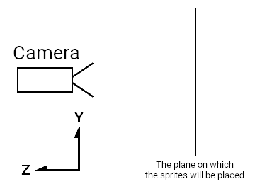
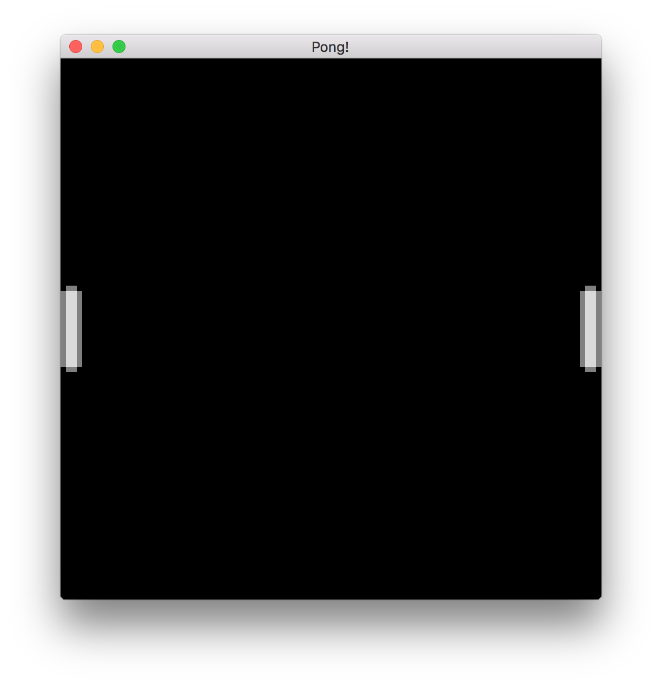

# Drawing the paddles

Now let's do some drawing! But to draw something, we need something to draw. In
Amethyst, those "somethings" are called entities.

Amethyst uses an Entity-Component-System (ECS) framework called **specs**, also
written in Rust. You can learn more about Specs in the [The Specs Book][sb].
Here's a basic explanation of ECS from the documentation:

> The term ECS is shorthand for Entity-Component-System. These are the three
> core concepts. Each **entity** is associated with some **components**. Those entities
> and components are processed by **systems**. This way, you have your data
> (components) completely separated from the behavior (systems). An entity just
> logically groups components; so a Velocity component can be applied to the
> Position component of the same entity.

I recommend at least skimming the rest of The Specs Book to get a good intuition
of how Amethyst works, especially if you're new to ECS.

## A quick refactor

Before adding more of the Pong logic, we are going to separate the application
initialization code from the Pong code.

1. In the `src` directory, create a new file called `pong.rs` and add the
   following `use` statements. These are needed to make it through this chapter:

    ```rust,edition2018,no_run,noplaypen
    # extern crate amethyst;
    #
    use amethyst::{
        assets::{AssetStorage, Loader, Handle},
        core::transform::Transform,
        ecs::{Component, DenseVecStorage},
        prelude::*,
        renderer::{Camera, ImageFormat, SpriteRender, SpriteSheet, SpriteSheetFormat, Texture},
    };
    ```

2. Move the `Pong` struct and the `impl SimpleState for Pong` block from
   `main.rs` into `pong.rs`.

3. In `main.rs` declare `pong` as a module and import the `Pong` state:

    ```rust,ignore
    mod pong;

    use crate::pong::Pong;
    ```

## Get around the World

First, in `pong.rs`, let's add a new method to our `State` implementation: `on_start`.
This method is called when the State starts. We will leave it empty for now.

```rust,edition2018,no_run,noplaypen
# extern crate amethyst;
# use amethyst::prelude::*;
# struct Pong;
impl SimpleState for Pong {
    fn on_start(&mut self, data: StateData<'_, GameData<'_, '_>>) {

    }
}
```

The `StateData<'_, GameData<'_, '_>>` is a structure given to all State methods.
The important part of its content here is its `world` field.

The `World` structure stores all of the game's runtime data -- entities and components.

## Rendering the game using the Camera

The first thing we will need in our game is a `Camera`. This is the component that
will determine what is rendered on screen. It behaves just like a real-life
camera: it looks at a specific part of the world and can be moved around at
will.

1. Define the size of the playable area at the top of `pong.rs`.

    ```rust,edition2018,no_run,noplaypen
    pub const ARENA_HEIGHT: f32 = 100.0;
    pub const ARENA_WIDTH: f32 = 100.0;
    ```

    These are public as they will be used in other modules.

2. Create the camera entity.

    In pong, we want the camera to cover the entire arena. Let's do it in a new function `initialise_camera`:

    ```rust,edition2018,no_run,noplaypen
    # extern crate amethyst;
    #
    # const ARENA_HEIGHT: f32 = 100.0;
    # const ARENA_WIDTH: f32 = 100.0;
    # use amethyst::prelude::*;
    # use amethyst::ecs::World;
    # use amethyst::renderer::Camera;
    # use amethyst::core::Transform;
    fn initialise_camera(world: &mut World) {
        // Setup camera in a way that our screen covers whole arena and (0, 0) is in the bottom left.
        let mut transform = Transform::default();
        transform.set_translation_xyz(ARENA_WIDTH * 0.5, ARENA_HEIGHT * 0.5, 1.0);

        world
            .create_entity()
            .with(Camera::standard_2d(ARENA_WIDTH, ARENA_HEIGHT))
            .with(transform)
            .build();
    }
    ```
    This creates an entity that will carry our camera, with an orthographic
    projection of the size of our arena. We also attach a `Transform` component,
    representing its position in the world.

    The `Camera::standard_2d` function creates a default 2D camera that is
    pointed along the world's **Z** axis. The area in front of the camera has a
    horizontal **X** axis, and a vertical **Y** axis. The **X** axis increases
    moving to the right, and the **Y** axis increases moving up. The camera's
    position is the center of the viewable area. We position the camera with
    `set_translation_xyz` to the middle of our game arena so that `(0, 0)` is
    the bottom left of the viewable area, and `(ARENA_WIDTH, ARENA_HEIGHT)` is
    the top right.

    Notice that we also shifted the camera `1.0` along the **Z** axis. This is
    to make sure that the camera is able to see the sprites that sit on the
    **XY** plane where **Z** is 0.0:

    

    > **Note:** Orthographic projections are a type of 3D visualization on 2D screens
    > that keeps the size ratio of the 2D images displayed intact. They are very
    > useful in games without actual 3D, like our pong example. Perspective projections
    > are another way of displaying graphics, more useful in 3D scenes.

3. To finish setting up the camera, we need to call `initialise_camera` from the
   Pong state's `on_start` method:

    ```rust,edition2018,no_run,noplaypen
    # extern crate amethyst;
    # use amethyst::prelude::*;
    # use amethyst::ecs::World;
    # fn initialise_camera(world: &mut World) { }
    # struct MyState;
    # impl SimpleState for MyState {
    fn on_start(&mut self, data: StateData<'_, GameData<'_, '_>>) {
        let world = data.world;

        initialise_camera(world);
    }
    # }
    ```

Now that our camera is set up, it's time to add the paddles.

## Our first Component

Now, we will create the `Paddle` component, all in `pong.rs`.

1. Define constants for the paddle width and height.

    ```rust,edition2018,no_run,noplaypen
    pub const PADDLE_HEIGHT: f32 = 16.0;
    pub const PADDLE_WIDTH: f32 = 4.0;
    ```

2. Define the `Side` enum and `Paddle` struct:

    ```rust,edition2018,no_run,noplaypen
    # pub const PADDLE_HEIGHT: f32 = 16.0;
    # pub const PADDLE_WIDTH: f32 = 4.0;
    #
    #[derive(PartialEq, Eq)]
    pub enum Side {
        Left,
        Right,
    }

    pub struct Paddle {
        pub side: Side,
        pub width: f32,
        pub height: f32,
    }

    impl Paddle {
        fn new(side: Side) -> Paddle {
            Paddle {
                side,
                width: PADDLE_WIDTH,
                height: PADDLE_HEIGHT,
            }
        }
    }
    ```

    *"But that just looks like a regular struct!"* you might say.

    And you're right, the special sauce comes next.

3. Implement the `Component` trait for `Paddle`:

    ```rust,edition2018,no_run,noplaypen
    # extern crate amethyst;
    #
    # use amethyst::ecs::{Component, DenseVecStorage};
    #
    # struct Paddle;
    #
    impl Component for Paddle {
        type Storage = DenseVecStorage<Self>;
    }
    ```

    By implementing `Component` for the `Paddle` struct, it can now be attached
    to entities in the game.

    When implementing the `Component` trait, we must specify the storage type.
    Different storage types optimize for faster access, lower memory usage, or a
    balance between the two. For more information on storage types, check out the
    [Specs documentation][sb-storage].

## Initialise some entities

Now that we have a `Paddle` component, let's define some paddle entities that
include that component and add them to our `World`.

First let's look at our imports:

```rust,edition2018,no_run,noplaypen
# extern crate amethyst;
use amethyst::core::transform::Transform;
```

`Transform` is an Amethyst ECS component which carries
position and orientation information. It is relative
to a parent, if one exists.

Okay, let's make some entities! We'll define an `initialise_paddles` function
which will create left and right paddle entities and attach a `Transform`
component to each to position them in our world. As we defined earlier,
our canvas is from `0.0` to `ARENA_WIDTH` in the horizontal dimension and
from `0.0` to `ARENA_HEIGHT` in the vertical dimension.
Keep in mind that the anchor point of our entities will be in the middle of the
image we will want to render on top of them. This is a good rule to follow in
general, as it makes operations like rotation easier.

```rust,edition2018,no_run,noplaypen
# extern crate amethyst;
# use amethyst::prelude::*;
# use amethyst::core::Transform;
# use amethyst::ecs::World;
# enum Side {
#   Left,
#   Right,
# }
# struct Paddle;
# impl amethyst::ecs::Component for Paddle {
#   type Storage = amethyst::ecs::VecStorage<Paddle>;
# }
# impl Paddle {
#   fn new(side: Side) -> Paddle { Paddle }
# }
# const PADDLE_HEIGHT: f32 = 16.0;
# const PADDLE_WIDTH: f32 = 4.0;
# const ARENA_HEIGHT: f32 = 100.0;
# const ARENA_WIDTH: f32 = 100.0;
/// Initialises one paddle on the left, and one paddle on the right.
fn initialise_paddles(world: &mut World) {
    let mut left_transform = Transform::default();
    let mut right_transform = Transform::default();

    // Correctly position the paddles.
    let y = ARENA_HEIGHT / 2.0;
    left_transform.set_translation_xyz(PADDLE_WIDTH * 0.5, y, 0.0);
    right_transform.set_translation_xyz(ARENA_WIDTH - PADDLE_WIDTH * 0.5, y, 0.0);

    // Create a left plank entity.
    world
        .create_entity()
        .with(Paddle::new(Side::Left))
        .with(left_transform)
        .build();

    // Create right plank entity.
    world
        .create_entity()
        .with(Paddle::new(Side::Right))
        .with(right_transform)
        .build();
}
```

This is all the information Amethyst needs to track and move the paddles in our
virtual world, but we'll need to do some more work to actually *draw* them.

As a sanity check, let's make sure the code for initialising the paddles
compiles. Update the `on_start` method to the following:

```rust,edition2018,no_run,noplaypen
# extern crate amethyst;
# use amethyst::prelude::*;
# use amethyst::ecs::World;
# fn initialise_paddles(world: &mut World) { }
# fn initialise_camera(world: &mut World) { }
# struct MyState;
# impl SimpleState for MyState {
fn on_start(&mut self, data: StateData<'_, GameData<'_, '_>>) {
    let world = data.world;

    initialise_paddles(world);
    initialise_camera(world);
}
# }
```

Let's run our blank screen game!

```text,ignore
Tried to fetch resource of type `MaskedStorage<Paddle>`[^1] from the `World`, but the resource does not exist.

You may ensure the resource exists through one of the following methods:

* Inserting it when the world is created: `world.insert(..)`.
* If the resource implements `Default`, include it in a system's `SystemData`, and ensure the system is registered in the dispatcher.
* If the resource does not implement `Default`, insert in the world during `System::setup`.

[^1]: Full type name: `amethyst::ecs::storage::MaskedStorage<pong::Paddle>`
```

Uh oh, what's wrong?

For a `Component` to be used, there must be a `Storage<ComponentType>` resource
set up in the `World`. The error message above means we have registered the
`Paddle` component on an entity, but have not set up the `Storage`. We can fix
this by adding the following line before `initialise_paddles(world)` in the
`on_start` method:

```rust,edition2018,no_run,noplaypen
# extern crate amethyst;
# use amethyst::ecs::{World, WorldExt};
# struct Paddle;
# impl amethyst::ecs::Component for Paddle {
#   type Storage = amethyst::ecs::VecStorage<Paddle>;
# }
# fn register() {
#   let mut world = World::new();
world.register::<Paddle>();
# }
```

This is rather inconvenient &mdash; to need to manually register each component
before it can be used. There *must* be a better way. **Hint:** there is.

When we add systems to our application, any component that a `System` uses is
automatically registered.
However, as we haven't got any `System`s, we have to
live with registering the `Paddle` component manually.

Let's run the game again.

## Bundles

Amethyst has a lot of internal systems it uses to keep things running we need
to bring into the context of the `World`. For simplicity, these have been
grouped into "Bundles" which include related systems and resources. We can
add these to our Application's `GameData` using the `with_bundle` method,
similarly to how you would register a system. We already have `RenderBundle` in place,
registering another one will look similar. You have to first import
`TransformBundle`, then register it as follows:

```rust,edition2018,no_run,noplaypen
# extern crate amethyst;
#
use amethyst::core::transform::TransformBundle;
#
# use amethyst::{
#     prelude::*,
#     utils::application_root_dir,
# };
#
# struct Pong;
# impl SimpleState for Pong { }
#
fn main() -> amethyst::Result<()> {
#   amethyst::start_logger(Default::default());
#
#   let app_root = application_root_dir()?;
#   let display_config_path =
#       app_root.join("examples/pong_tutorial_02/config/display.ron");
#
    // ...
    let game_data = GameDataBuilder::default()
        // ...

        // Add the transform bundle which handles tracking entity positions
        .with_bundle(TransformBundle::new())?;

#   let assets_dir = "/";
#   let mut game = Application::new(assets_dir, Pong, game_data)?;
#   Ok(())
}
```

This time, when you run the game you should see the familiar black screen.
Hooray!

## Drawing

This section will finally allow us to see something.

The first thing we will have to do is load the sprite sheet we will use for all
our graphics in the game. Create a `texture` folder in the `assets` directory of the project.
This will contain the [spritesheet texture][ss] `pong_spritesheet.png`, which we
need to render the elements of the game.  We will perform the loading in a new
function in `pong.rs` called `load_sprite_sheet`.

First, let's declare the function and load the sprite sheet's image data.

```rust,edition2018,no_run,noplaypen
# extern crate amethyst;
#
# use amethyst::{
#     assets::{AssetStorage, Loader, Handle},
#     core::transform::Transform,
#     ecs::{Component, DenseVecStorage},
#     prelude::*,
#     renderer::{
#         camera::Camera,
#         formats::texture::ImageFormat,
#         sprite::{SpriteRender, SpriteSheet, SpriteSheetFormat},
#         Texture,
#     },
# };
#
fn load_sprite_sheet(world: &mut World) -> Handle<SpriteSheet> {
    // Load the sprite sheet necessary to render the graphics.
    // The texture is the pixel data
    // `texture_handle` is a cloneable reference to the texture
    let texture_handle = {
        let loader = world.read_resource::<Loader>();
        let texture_storage = world.read_resource::<AssetStorage<Texture>>();
        loader.load(
            "texture/pong_spritesheet.png",
            ImageFormat::default(),
            (),
            &texture_storage,
        )
    };

    //...
#   unimplemented!()
}
```

The `Loader` is an asset loader which is defined as a resource (not an
`Entity`, `Component`, or `System`, but still a part of our ECS `World`). It was
created when we built our Application in `main.rs`, and it can read assets like
.obj files, but also it can `load` a .png as a `Texture` as in our use case.

> Resources in Specs are a type of data which can be shared between systems,
> while being independent of entities, in contrast to components, which are
> attached to specific entities.

The `AssetStorage<Texture>` is also a resource; this is where the loader
puts the `Texture` it will load from our sprite sheet. In order to manage them
while remaining fast, Amethyst does not give us direct access to the assets we load.
If it did otherwise, we would have to wait for the texture to be fully loaded to do all the
other things we have to prepare, which would be a waste of time!
Instead, the `load` function will return a `Handle<Texture>`.
This handle "points" to the place where the asset will be loaded. In Rust terms, it is
equivalent to a reference-counted option. It is extremely useful, especially as cloning
the handle does not clone the asset in memory, so many things can use the same asset at once.

Alongside our sprite sheet texture, we need a file describing where the sprites
are on the sheet. Let's create, right next to it, a file called
`pong_spritesheet.ron`. It will contain the following sprite sheet definition:

```text,ignore
List((
    texture_width: 8,
    texture_height: 16,
    sprites: [
        (
            x: 0,
            y: 0,
            width: 4,
            height: 16,
        ),
        (
            x: 4,
            y: 0,
            width: 4,
            height: 4,
        ),
    ],
))
```

> **Note:** Make sure to pay attention to the kind of parentheses in the ron file.
> Especially, if you are used to writing JSON or similar format files, you might
> be tempted to use curly braces there; that will however lead to very
> hard-to-debug errors, especially since amethyst will not warn you about that
> when compiling.

Finally, we load the file containing the position of each sprite on the sheet.

```rust,edition2018,no_run,noplaypen
# extern crate amethyst;
#
# use amethyst::{
#     assets::{AssetStorage, Handle, Loader},
#     core::transform::Transform,
#     ecs::{Component, DenseVecStorage},
#     prelude::*,
#     renderer::{
#         camera::Camera,
#         formats::texture::ImageFormat,
#         sprite::{SpriteRender, SpriteSheet, SpriteSheetFormat},
#         Texture,
#     },
# };
#
fn load_sprite_sheet(world: &mut World) -> Handle<SpriteSheet> {
#
#   let texture_handle = {
#       let loader = world.read_resource::<Loader>();
#       let texture_storage = world.read_resource::<AssetStorage<Texture>>();
#       loader.load(
#           "texture/pong_spritesheet.png",
#           ImageFormat::default(),
#           (),
#           &texture_storage,
#       )
#   };
#
    // ...

    let loader = world.read_resource::<Loader>();
    let sprite_sheet_store = world.read_resource::<AssetStorage<SpriteSheet>>();
    loader.load(
        "texture/pong_spritesheet.ron", // Here we load the associated ron file
        SpriteSheetFormat(texture_handle),
        (),
        &sprite_sheet_store,
    )
# }
```

This is where we have to use the texture handle. The `Loader` will take the
file containing the sprites' positions and the texture handle, and create a
nicely packaged `SpriteSheet` struct. It is this struct that we will be using
to actually draw stuff on the screen.

Please note that the order of sprites declared in the sprite sheet file
is also significant, as sprites are referenced by the index in
the vector. If you're wondering about the ball sprite, it does exist on the
image, but we will get to it in a later part of the tutorial.

So far, so good. We have a sprite sheet loaded, now we need to link the sprites
to the paddles. We update the `initialise_paddles` function by changing its
signature to:

```rust,edition2018,no_run,noplaypen
# extern crate amethyst;
# use amethyst::ecs::World;
# use amethyst::{assets::Handle, renderer::sprite::SpriteSheet};
fn initialise_paddles(world: &mut World, sprite_sheet_handle: Handle<SpriteSheet>)
# { }
```

Inside `initialise_paddles`, we construct a `SpriteRender` for a paddle. We
only need one here, since the only difference between the two paddles is that
the right one is flipped horizontally.

```rust,edition2018,no_run,noplaypen
# extern crate amethyst;
# use amethyst::ecs::World;
# use amethyst::{assets::Handle, renderer::{SpriteRender, SpriteSheet}};
# fn initialise_paddles(world: &mut World, sprite_sheet_handle: Handle<SpriteSheet>) {
// Assign the sprites for the paddles
let sprite_render = SpriteRender::new(sprite_sheet_handle, 0);  // paddle is the first sprite in the sprite_sheet
# }
```

`SpriteRender` is the `Component` that indicates which sprite of which sprite
sheet should be drawn for a particular entity. Since the paddle is the first
sprite in the sprite sheet, we use `0` for the `sprite_number`.

Next we simply add the components to the paddle entities:

```rust,edition2018,no_run,noplaypen
# extern crate amethyst;
# use amethyst::ecs::World;
# use amethyst::assets::Handle;
# use amethyst::renderer::sprite::{SpriteSheet, SpriteRender};
# use amethyst::prelude::*;
# fn initialise_paddles(world: &mut World, sprite_sheet_handle: Handle<SpriteSheet>) {
# let sprite_render = SpriteRender::new(sprite_sheet_handle, 0);  // paddle is the first sprite in the sprite_sheet
// Create a left plank entity.
world
    .create_entity()
    .with(sprite_render.clone())
    // ... other components
    .build();

// Create right plank entity.
world
    .create_entity()
    .with(sprite_render)
    // ... other components
    .build();
# }
```

We're nearly there, we just have to wire up the sprite to the paddles. We put it
all together in the `on_start()` method:

```rust,edition2018,no_run,noplaypen
# extern crate amethyst;
# use amethyst::assets::Handle;
# use amethyst::prelude::*;
# use amethyst::renderer::{sprite::SpriteSheet, Texture};
# use amethyst::ecs::World;
# struct Paddle;
# impl amethyst::ecs::Component for Paddle {
#   type Storage = amethyst::ecs::VecStorage<Paddle>;
# }
# fn initialise_paddles(world: &mut World, spritesheet: Handle<SpriteSheet>) { }
# fn initialise_camera(world: &mut World) { }
# fn load_sprite_sheet(world: &mut World) -> Handle<SpriteSheet> { unimplemented!() }
# struct MyState;
# impl SimpleState for MyState {
fn on_start(&mut self, data: StateData<'_, GameData<'_, '_>>) {
    let world = data.world;

    // Load the spritesheet necessary to render the graphics.
    let sprite_sheet_handle = load_sprite_sheet(world);

    world.register::<Paddle>();

    initialise_paddles(world, sprite_sheet_handle);
    initialise_camera(world);
}
# }
```

And we're done. Let's run our game and have fun!

If all is well, we should get something that looks like this:



In the next chapter, we'll explore the "S" in ECS and actually get these paddles
moving!

[sb]: https://specs.amethyst.rs/docs/tutorials/
[sb-storage]: https://specs.amethyst.rs/docs/tutorials/05_storages.html#densevecstorage
[2d]: https://docs.amethyst.rs/stable/amethyst_renderer/struct.Camera.html#method.standard_2d
[ss]: ../images/pong_tutorial/pong_spritesheet.png
