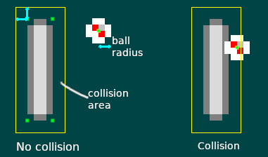

# Making a ball move and bounce

In the previous chapter, we learned how to capture user input
to make things move on the screen by creating a `System` ourselves.
This chapter will reuse all the knowledge we acquired through the
previous chapters to add a new object to our game: a ball that moves
and bounces around!

First, let's define some other useful constants for this chapter in `pong.rs`:

```rust,edition2018,no_run,noplaypen
pub const BALL_VELOCITY_X: f32 = 75.0;
pub const BALL_VELOCITY_Y: f32 = 50.0;
pub const BALL_RADIUS: f32 = 2.0;
```

This could also be done by using an external config file. This is
especially useful when you want to edit values a lot. Here, we're
keeping it simple.

## Create our next Component: The ball Component!

In `pong.rs`, let's create the `Ball` Component.

```rust,edition2018,no_run,noplaypen
# extern crate amethyst;
# use amethyst::ecs::{Component, DenseVecStorage};
pub struct Ball {
    pub velocity: [f32; 2],
    pub radius: f32,
}

impl Component for Ball {
    type Storage = DenseVecStorage<Self>;
}
```

A ball has a velocity and a radius, so we store that information in the component.

Then let's add an `initialise_ball` function the same way we wrote the
`initialise_paddles` function.

```rust,edition2018,no_run,noplaypen
# extern crate amethyst;
# use amethyst::prelude::*;
# use amethyst::assets::{Loader, AssetStorage, Handle};
# use amethyst::renderer::{Texture, SpriteRender, Sprite, SpriteSheet};
# use amethyst::core::transform::Transform;
# use amethyst::ecs::{Component, DenseVecStorage, World};
# pub struct Ball {
#    pub velocity: [f32; 2],
#    pub radius: f32,
# }
# impl Component for Ball {
#    type Storage = DenseVecStorage<Self>;
# }
# const PADDLE_HEIGHT: f32 = 16.0;
# const PADDLE_WIDTH: f32 = 4.0;
# const SPRITESHEET_SIZE: (f32, f32) = (8.0, 16.0);
# const BALL_RADIUS: f32 = 2.0;
# const BALL_VELOCITY_X: f32 = 75.0;
# const BALL_VELOCITY_Y: f32 = 50.0;
# const ARENA_HEIGHT: f32 = 100.0;
# const ARENA_WIDTH: f32 = 100.0;
/// Initialises one ball in the middle-ish of the arena.
fn initialise_ball(world: &mut World, sprite_sheet_handle: Handle<SpriteSheet>) {
    // Create the translation.
    let mut local_transform = Transform::default();
    local_transform.set_translation_xyz(ARENA_WIDTH / 2.0, ARENA_HEIGHT / 2.0, 0.0);

    // Assign the sprite for the ball. The ball is the second sprite in the sheet.
    let sprite_render = SpriteRender::new(sprite_sheet_handle, 1);

    world
        .create_entity()
        .with(sprite_render)
        .with(Ball {
            radius: BALL_RADIUS,
            velocity: [BALL_VELOCITY_X, BALL_VELOCITY_Y],
        })
        .with(local_transform)
        .build();
}
```

In [a previous chapter][pong_02_drawing] we saw how to load a sprite sheet
and get things drawn on the screen. Remember sprite sheet information
is stored in `pong_spritesheet.ron`, and the ball sprite was the
second one, whose index is `1`.

Finally, let's make sure the code is working as intended by updating the `on_start` method:

```rust,edition2018,no_run,noplaypen
# extern crate amethyst;
# use amethyst::prelude::*;
# use amethyst::assets::Handle;
# use amethyst::renderer::{Texture, SpriteSheet};
# use amethyst::ecs::{Component, World, VecStorage};
# struct Paddle;
# impl Component for Paddle {
#   type Storage = VecStorage<Self>;
# }
# struct Ball;
# impl Component for Ball {
#   type Storage = VecStorage<Self>;
# }
# fn initialise_ball(world: &mut World, sprite_sheet_handle: Handle<SpriteSheet>) { }
# fn initialise_paddles(world: &mut World, spritesheet: Handle<SpriteSheet>) { }
# fn initialise_camera(world: &mut World) { }
# fn load_sprite_sheet(world: &mut World) -> Handle<SpriteSheet> { unimplemented!() }
# struct MyState;
# impl SimpleState for MyState {
fn on_start(&mut self, data: StateData<'_, GameData<'_, '_>>) {
    let world = data.world;

    // Load the spritesheet necessary to render the graphics.
    let sprite_sheet_handle = load_sprite_sheet(world);

    world.register::<Ball>(); // <- add this line temporarily

    initialise_ball(world, sprite_sheet_handle.clone()); // <- add this line
    initialise_paddles(world, sprite_sheet_handle);
    initialise_camera(world);
}
# }
```

Don't forget to call `clone` on `sprite_sheet_handle` because `initialise_paddles` and
`initialise_ball` *consume* the handle.

By running the game now, you should be able to see the two paddles and the ball
in the center. In the next section, we're going to make this ball actually move!

## Create systems to make the ball move

We're now ready to implement the `MoveBallsSystem` in `systems/move_balls.rs`:

```rust,edition2018,no_run,noplaypen
# extern crate amethyst;
# use amethyst::ecs::{Component, DenseVecStorage};
#
# mod pong {
#     use amethyst::ecs::prelude::*;
#
#     pub struct Ball {
#        pub velocity: [f32; 2],
#        pub radius: f32,
#     }
#     impl Component for Ball {
#        type Storage = DenseVecStorage<Self>;
#     }
# }
#
use amethyst::{
    core::timing::Time,
    core::transform::Transform,
    core::SystemDesc,
    derive::SystemDesc,
    ecs::{Join, Read, ReadStorage, System, SystemData, World, WriteStorage},
};

use crate::pong::Ball;

#[derive(SystemDesc)]
pub struct MoveBallsSystem;

impl<'s> System<'s> for MoveBallsSystem {
    type SystemData = (
        ReadStorage<'s, Ball>,
        WriteStorage<'s, Transform>,
        Read<'s, Time>,
    );

    fn run(&mut self, (balls, mut locals, time): Self::SystemData) {
        // Move every ball according to its speed, and the time passed.
        for (ball, local) in (&balls, &mut locals).join() {
            local.prepend_translation_x(ball.velocity[0] * time.delta_seconds());
            local.prepend_translation_y(ball.velocity[1] * time.delta_seconds());
        }
    }
}
#
# fn main() {}
```

This system is responsible for moving all balls according to their speed and
the elapsed time. Notice how the `join()` method is used to iterate over all
ball entities. Here we only have one ball, but if we ever need multiple, the
system will handle them out of the box.
In this system, we also want *framerate independence*.
That is, no matter the framerate, all objects move with the same speed.
To achieve that, a **delta time**, which is the duration since the last frame, is used.
This is commonly known as ["delta timing"][delta_timing].
As you can see in the snippet, to gain access to time passed since the last frame,
you need to use [`amethyst::core::timing::Time`][doc_time], a commonly used
resource. It has a method called `delta_seconds` that does exactly what we want.

Now that our ball can move, let's implement a new System:
`BounceSystem` in `systems/bounce.rs`.
It will be responsible for detecting collisions between balls and
paddles, as well as balls and the top and bottom edges of the arena.
If a collision is detected, the ball bounces off. This is done
by negating the velocity of the `Ball` component on the `x` or `y` axis.

```rust,edition2018,no_run,noplaypen
# extern crate amethyst;
# use amethyst::ecs::{Component, DenseVecStorage};
#
# mod pong {
#     use amethyst::ecs::prelude::*;
#
#     pub struct Ball {
#        pub velocity: [f32; 2],
#        pub radius: f32,
#     }
#     impl Component for Ball {
#        type Storage = DenseVecStorage<Self>;
#     }
#
#     #[derive(PartialEq, Eq)]
#     pub enum Side {
#       Left,
#       Right,
#     }
#
#     pub struct Paddle {
#       pub side: Side,
#       pub width: f32,
#       pub height: f32,
#     }
#     impl Component for Paddle {
#       type Storage = VecStorage<Self>;
#     }
#
#     pub const ARENA_HEIGHT: f32 = 100.0;
# }
#
use amethyst::{
    core::{Transform, SystemDesc},
    derive::SystemDesc,
    ecs::{Join, ReadStorage, System, SystemData, World, WriteStorage},
};

use crate::pong::{Ball, Side, Paddle, ARENA_HEIGHT};

# #[derive(SystemDesc)]
pub struct BounceSystem;

impl<'s> System<'s> for BounceSystem {
    type SystemData = (
        WriteStorage<'s, Ball>,
        ReadStorage<'s, Paddle>,
        ReadStorage<'s, Transform>,
    );

    fn run(&mut self, (mut balls, paddles, transforms): Self::SystemData) {
        // Check whether a ball collided, and bounce off accordingly.
        //
        // We also check for the velocity of the ball every time, to prevent multiple collisions
        // from occurring.
        for (ball, transform) in (&mut balls, &transforms).join() {
            let ball_x = transform.translation().x;
            let ball_y = transform.translation().y;

            // Bounce at the top or the bottom of the arena.
            if (ball_y <= ball.radius && ball.velocity[1] < 0.0)
                || (ball_y >= ARENA_HEIGHT - ball.radius && ball.velocity[1] > 0.0)
            {
                ball.velocity[1] = -ball.velocity[1];
            }

            // Bounce at the paddles.
            for (paddle, paddle_transform) in (&paddles, &transforms).join() {
                let paddle_x = paddle_transform.translation().x - (paddle.width * 0.5);
                let paddle_y = paddle_transform.translation().y - (paddle.height * 0.5);

                // To determine whether the ball has collided with a paddle, we create a larger
                // rectangle around the current one, by subtracting the ball radius from the
                // lowest coordinates, and adding the ball radius to the highest ones. The ball
                // is then within the paddle if its center is within the larger wrapper
                // rectangle.
                if point_in_rect(
                    ball_x,
                    ball_y,
                    paddle_x - ball.radius,
                    paddle_y - ball.radius,
                    paddle_x + paddle.width + ball.radius,
                    paddle_y + paddle.height + ball.radius,
                ) {
                    if (paddle.side == Side::Left && ball.velocity[0] < 0.0)
                        || (paddle.side == Side::Right && ball.velocity[0] > 0.0)
                    {
                        ball.velocity[0] = -ball.velocity[0];
                    }
                }
            }
        }
    }
}

// A point is in a box when its coordinates are smaller or equal than the top
// right and larger or equal than the bottom left.
fn point_in_rect(x: f32, y: f32, left: f32, bottom: f32, right: f32, top: f32) -> bool {
    x >= left && x <= right && y >= bottom && y <= top
}
#
# fn main() {}
```

The following image illustrates how collisions with paddles are checked.



Also, don't forget to add `mod move_balls` and `mod bounce` in `systems/mod.rs`
as well as adding our new systems to the game data:

```rust,edition2018,no_run,noplaypen
# extern crate amethyst;
# use amethyst::prelude::*;
# use amethyst::core::transform::TransformBundle;
# use amethyst::window::DisplayConfig;
# use amethyst::input::StringBindings;
# fn main() -> amethyst::Result<()> {
# let path = "./config/display.ron";
# let config = DisplayConfig::load(&path)?;
# mod systems {
# use amethyst;
# use amethyst::core::ecs::{System, SystemData, World};
# use amethyst::core::SystemDesc;
# use amethyst::derive::SystemDesc;
# #[derive(SystemDesc)]
# pub struct PaddleSystem;
# impl<'a> amethyst::ecs::System<'a> for PaddleSystem {
# type SystemData = ();
# fn run(&mut self, _: Self::SystemData) { }
# }
# #[derive(SystemDesc)]
# pub struct MoveBallsSystem;
# impl<'a> amethyst::ecs::System<'a> for MoveBallsSystem {
# type SystemData = ();
# fn run(&mut self, _: Self::SystemData) { }
# }
# #[derive(SystemDesc)]
# pub struct BounceSystem;
# impl<'a> amethyst::ecs::System<'a> for BounceSystem {
# type SystemData = ();
# fn run(&mut self, _: Self::SystemData) { }
# }
# }
# let input_bundle = amethyst::input::InputBundle::<StringBindings>::new();
let game_data = GameDataBuilder::default()
#    .with_bundle(TransformBundle::new())?
#    .with_bundle(input_bundle)?
#    .with(systems::PaddleSystem, "paddle_system", &["input_system"])
    // ...other systems...
    .with(systems::MoveBallsSystem, "ball_system", &[])
    .with(
        systems::BounceSystem,
        "collision_system",
        &["paddle_system", "ball_system"],
    );
# let assets_dir = "/";
# struct Pong;
# impl SimpleState for Pong { }
# let mut game = Application::new(assets_dir, Pong, game_data)?;
# Ok(())
# }
```

You should now have a ball moving and bouncing off paddles and off the top
and bottom of the screen. However, you will quickly notice that if the ball
goes out of the screen on the right or the left, it never comes back
and the game is over. You might not even see that at all, as the ball might be already
outside of the screen when the window comes up. You might have to dramatically reduce
`BALL_VELOCITY_X` in order to see that in action. This obviously isn't a good solution for an actual game.
To fix that problem and better see what's happening we have to spawn the ball with a slight delay.

## Spawning ball with a delay

The ball now spawns and moves off screen instantly when the game starts. This might be disorienting,
as you might be thrown into the game and lose your first point before you had the time to notice.
We also have to give some time for the operating system and the renderer to initialize the window
before the game starts. Usually, you would have a separate state with a game menu, so this isn't an issue.
Our pong game throws you right into the action, so we have to fix that problem.

Let's delay the first time the ball spawns. This is also a good opportunity to use our game state
struct to actually hold some data.

First, let's add a new method to our state: `update`.
Let's add that `update` method just below `on_start`:

```rust,edition2018,no_run,noplaypen
# extern crate amethyst;
# use amethyst::prelude::*;
# struct MyState;
# impl SimpleState for MyState {
fn update(&mut self, data: &mut StateData<'_, GameData<'_, '_>>) -> SimpleTrans {
    Trans::None
}
# }
```

That method allows you to transition out of state using its return value.
Here, we do not want to change any state, so we return `Trans::None`.

Now we have to move paddle creation to that method and add some delay to it. Our `update` runs every frame,
so in order to do something only once after a given time, we have to use our local state.
Additionally, notice that `initialise_paddles` requires us to provide the `sprite_sheet_handle`, but it was created
as a local variable inside `on_start`. For that reason, we have to make it a part of the state too.

Let's add some fields to our `Pong` struct:

```rust,edition2018,no_run,noplaypen
# extern crate amethyst; use amethyst::renderer::SpriteSheet;
# use amethyst::assets::Handle;
#[derive(Default)]
pub struct Pong {
    ball_spawn_timer: Option<f32>,
    sprite_sheet_handle: Option<Handle<SpriteSheet>>,
}
```

Our timer is represented by `Option<f32>`, which will count down to zero when available, and be replaced with `None` after
the time has passed. Our sprite sheet handle is also inside `Option` because we can't create it inside `Pong` constructor.
It will be created inside the `on_start` method instead.

We've also added `#[derive(Default)]`, which will automatically implement `Default` trait for us, which allows to create
default empty state. Now let's use that inside our `Application` creation code in `main.rs`:

```rust,edition2018,no_run,noplaypen
# extern crate amethyst;
# use amethyst::{
#     ecs::{World, WorldExt},
#     prelude::*,
# };
#
# #[derive(Default)] struct Pong;
# impl SimpleState for Pong { }
# fn main() -> amethyst::Result<()> {
#   let game_data = GameDataBuilder::default();
#   let assets_dir = "/";
#   let world = World::new();
let mut game = Application::new(assets_dir, Pong::default(), game_data)?;
#   Ok(())
# }
```

Now let's finish our timer and ball spawning code. We have to do two things:
- First, we have to initialize our state and remove `initialise_ball` from `on_start`,
- then we have to `initialise_ball` once after the time has passed inside `update`:

```rust,edition2018,no_run,noplaypen
# extern crate amethyst;
# use amethyst::{assets::Handle, renderer::SpriteSheet};
# use amethyst::prelude::*;
use amethyst::core::timing::Time;

# struct Paddle;
# impl amethyst::ecs::Component for Paddle {
#   type Storage = amethyst::ecs::VecStorage<Self>;
# }
# struct Ball;
# impl amethyst::ecs::Component for Ball {
#   type Storage = amethyst::ecs::VecStorage<Self>;
# }
# fn initialise_ball(world: &mut World, sprite_sheet_handle: Handle<SpriteSheet>) { }
# fn initialise_paddles(world: &mut World, spritesheet: Handle<SpriteSheet>) { }
# fn initialise_camera(world: &mut World) { }
# fn load_sprite_sheet(world: &mut World) -> Handle<SpriteSheet> { unimplemented!() }
# #[derive(Default)] pub struct Pong {
#     ball_spawn_timer: Option<f32>,
#     sprite_sheet_handle: Option<Handle<SpriteSheet>>,
# }
#
impl SimpleState for Pong {
    fn on_start(&mut self, data: StateData<'_, GameData<'_, '_>>) {
        let world = data.world;

        // Wait one second before spawning the ball.
        self.ball_spawn_timer.replace(1.0);

        // Load the spritesheet necessary to render the graphics.
        // `spritesheet` is the layout of the sprites on the image;
        // `texture` is the pixel data.
        self.sprite_sheet_handle.replace(load_sprite_sheet(world));
        initialise_paddles(world, self.sprite_sheet_handle.clone().unwrap());
        initialise_camera(world);
    }

    fn update(&mut self, data: &mut StateData<'_, GameData<'_, '_>>) -> SimpleTrans {
        if let Some(mut timer) = self.ball_spawn_timer.take() {
            // If the timer isn't expired yet, subtract the time that passed since the last update.
            {
                let time = data.world.fetch::<Time>();
                timer -= time.delta_seconds();
            }
            if timer <= 0.0 {
                // When timer expire, spawn the ball
                initialise_ball(data.world, self.sprite_sheet_handle.clone().unwrap());
            } else {
                // If timer is not expired yet, put it back onto the state.
                self.ball_spawn_timer.replace(timer);
            }
        }
        Trans::None
    }
}
```

Now our ball will only show up after a set delay, giving us some breathing room after startup.
This will give us a better opportunity to see what happens to the ball immediately when it spawns.

## Summary

In this chapter, we finally added a ball to our game. As always, the full code
is available under the `pong_tutorial_04` example in the Amethyst repository.
In the next chapter, we'll add a system checking when a player loses the game,
and add a scoring system!

[pong_02_drawing]: pong-tutorial-02.html#drawing
[doc_time]: https://docs.amethyst.rs/stable/amethyst_core/timing/struct.Time.html
[delta_timing]: https://en.wikipedia.org/wiki/Delta_timing
