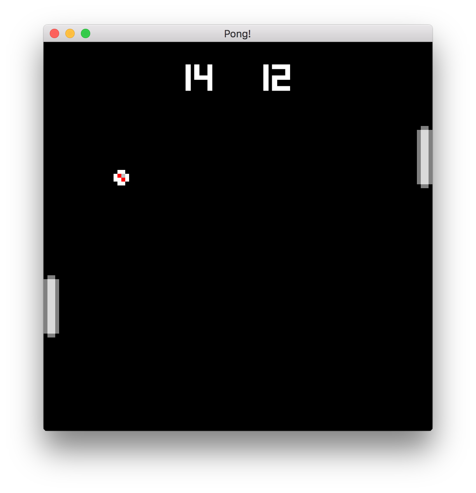

# Winning Rounds and Keeping Score

Our last chapter ended on a bit of a cliffhanger. What happens when our ball
reaches the left or right edge of the screen? It just keeps going! 😦

In this chapter, we'll fix that by putting the ball back into play after it
leaves either side of the arena. We'll also add a scoreboard and keep track of
who's winning and losing.

## Winning and Losing Rounds

So let's fix the big current issue; having a game that only works for one
round isn't very fun. We'll add a new system that will check if the ball has
reached either edge of the arena and reset its position and velocity. We'll also
make a note of who got the point for the round.

First, we'll add a new module to `systems/mod.rs`

```rust
pub use self::winner::WinnerSystem;

mod winner;
```

Then, we'll create `systems/winner.rs`:

```rust
# mod pong {
#   pub struct Ball {
#       pub radius: f32,
#       pub velocity: [f32; 2],
#   }
# 
#   pub const ARENA_WIDTH: f32 = 100.0;
#   pub const ARENA_HEIGHT: f32 = 100.0;
# }
# 
use amethyst::{
    core::transform::Transform,
    ecs::{System, World},
};

use crate::pong::{Ball, ARENA_HEIGHT, ARENA_WIDTH};

pub struct WinnerSystem;

impl System for WinnerSystem {
    type SystemData = (.write_component::<Ball>() .write_component::<Transform>);

    fn run(&mut self, (mut balls, mut locals): Self::SystemData) {
        for (ball, transform) in (&mut balls, &mut locals).join() {
            let ball_x = transform.translation().x;

            let did_hit = if ball_x <= ball.radius {
                // Right player scored on the left side.
                println!("Player 2 Scores!");
                true
            } else if ball_x >= ARENA_WIDTH - ball.radius {
                // Left player scored on the right side.
                println!("Player 1 Scores!");
                true
            } else {
                false
            };

            if did_hit {
                ball.velocity[0] = -ball.velocity[0]; // Reverse Direction
                transform.set_translation_x(ARENA_WIDTH / 2.0); // Reset Position
                transform.set_translation_y(ARENA_HEIGHT / 2.0); // Reset Position
            }
        }
    }
}
# fn main() {}
```

Here, we're creating a new system, joining on all `Entities` that have a `Ball`
and a `Transform` component, and then checking each ball to see if it has
reached either the left or right boundary of the arena. If so, we reverse
its direction and put it back in the middle of the screen.

Now, we need to add our new system to `main.rs`, and we should be able to
keep playing after someone scores and log who got the point.

```rust
# use amethyst::{
#   core::transform::TransformBundle, ecs::World, input::StringBindings, prelude::*,
#   window::DisplayConfig,
# };
# 
# mod systems {
#   use amethyst::core::ecs::{System, World};
# 
#   pub struct PaddleSystem;
#   impl System for PaddleSystem {
#       fn build(mut self) -> Box<dyn ParallelRunnable> {}
#   }
#   pub struct MoveBallsSystem;
#   impl System for MoveBallsSystem {
#       fn build(mut self) -> Box<dyn ParallelRunnable> {}
#   }
#   pub struct BounceSystem;
#   impl System for BounceSystem {
#       fn build(mut self) -> Box<dyn ParallelRunnable> {}
#   }
#   pub struct WinnerSystem;
#   impl System for WinnerSystem {
#       fn build(mut self) -> Box<dyn ParallelRunnable> {}
#   }
# }
# 
# fn main() -> amethyst::Result<()> {
#   let path = "./config/display.ron";
#   let config = DisplayConfig::load(&path)?;
#   let input_bundle = amethyst::input::InputBundle::new();
# 
    let game_data = DispatcherBuilder::default()
#       .add_bundle(TransformBundle::new())?
#       .add_bundle(input_bundle)?
#       .with(systems::PaddleSystem, "paddle_system", &["input_system"])
#       .with(systems::MoveBallsSystem, "ball_system", &[])
#       .with(
#           systems::BounceSystem,
#           "collision_system",
#           &["paddle_system", "ball_system"],
#       )
        .with(systems::WinnerSystem, "winner_system", &["ball_system"]);
#   let assets_dir = "/";
#   struct Pong;
#   impl SimpleState for Pong {}
#   let mut game = Application::new(assets_dir, Pong, game_data)?;
#   Ok(())
# }
```

## Adding a Scoreboard

We have a pretty functional Pong game now! At this point, the least fun thing
about the game is that players have to keep track of the score themselves.
Our game should be able to do that for us.

In this section, we'll set up UI rendering for our game and create a scoreboard
to display our players' scores.

First, let's add the UI rendering in `main.rs`. Add the following imports:

```rust
use amethyst::ui::{RenderUi, UiBundle};
```

Then, add a `RenderUi` plugin to your `RenderBundle` like so:

```rust
# use amethyst::{
#   ecs::World,
#   prelude::*,
#   renderer::{types::DefaultBackend, RenderingBundle},
#   ui::RenderUi,
# };
# fn main() -> Result<(), amethyst::Error> {
#   let game_data = DispatcherBuilder::default()
        .add_bundle(
            RenderingBundle::<DefaultBackend>::new()
                // ...
                .with_plugin(RenderUi::default()),
        )?;
#   Ok(())
# }
```

Finally, add the `UiBundle` after the `InputBundle`:

```rust
# use amethyst::ui::UiBundle;
# use amethyst::{ecs::World, input::StringBindings, prelude::*};
# fn main() -> Result<(), amethyst::Error> {
#   let display_config_path = "";
#   struct Pong;
#   let game_data = DispatcherBuilder::default()
.add_bundle(UiBundle::new())?
#;
# 
#   Ok(())
# }
```

We're adding a `RenderUi` to our `RenderBundle`, and we're also adding the
`UiBundle` to our game data. This allows us to start
rendering UI visuals to our game in addition to the existing background and
sprites.

> **Note:** We're using a `UiBundle` with type `StringBindings` here because the
> `UiBundle` needs to know what types our `InputHandler` is using to map `actions`
> and `axes`. So know that your `UiBundle` type should match your
> `InputHandler` type. You can read more about those here: [UiBundle][ui-bundle],
> [InputHandler][input-handler].

Now we have everything set up so we can start rendering a scoreboard in our
game. We'll start by creating some structures in `pong.rs`:

```rust
/// ScoreBoard contains the actual score data
#[derive(Default)]
pub struct ScoreBoard {
    pub score_left: i32,
    pub score_right: i32,
}

/// ScoreText contains the ui text components that display the score
pub struct ScoreText {
    pub p1_score: Entity,
    pub p2_score: Entity,
}
```

> Don't glimpse over the `#[derive(Default)]` annotation for the `ScoreBoard` struct!

`ScoreBoard` is a container that will allow us to keep track of each
player's score. We'll use this in another module later in this chapter, so we've
gone ahead and marked it as public (same with `ScoreText`). `ScoreText` is also
a container, but this one holds handles to the UI `Entity`s that will be
rendered to the screen. We'll create those next:

```rust
use amethyst::ui::{Anchor, LineMode, TtfFormat, UiText, UiTransform};

# pub struct Pong;
# 
impl SimpleState for Pong {
    fn on_start(&mut self, data: StateData<'_, GameData>) {
#       let world = data.world;
        // --snip--

        initialize_scoreboard(world);
    }
}
// ...

/// initializes a ui scoreboard
fn initialize_scoreboard(world: &mut World) {
    let font = resources.get::<DefaultLoader>().load(
        "font/square.ttf",
        TtfFormat,
        (),
        resources.get().unwrap(),
    );
    let p1_transform = UiTransform::new(
        "P1".to_string(),
        Anchor::TopMiddle,
        Anchor::TopMiddle,
        -50.,
        -50.,
        1.,
        200.,
        50.,
    );
    let p2_transform = UiTransform::new(
        "P2".to_string(),
        Anchor::TopMiddle,
        Anchor::TopMiddle,
        50.,
        -50.,
        1.,
        200.,
        50.,
    );

    let p1_score = world
        .push((p1_transform,UiText::new(
            font.clone(),
            "0".to_string(),
            [1., 1., 1., 1.],
            50.,
            LineMode::Single,
            Anchor::Middle,
        ));

    let p2_score = world
        .push((p2_transform,UiText::new(
            font,
            "0".to_string(),
            [1., 1., 1., 1.],
            50.,
            LineMode::Single,
            Anchor::Middle,
        ));

#   pub struct ScoreText {
#       pub p1_score: Entity,
#       pub p2_score: Entity,
#   }
    world.insert(ScoreText { p1_score, p2_score });
}
```

Here, we add some UI imports and create a new `initialize_scoreboard` function,
which we'll call in the `on_start` method of the `Pong` game state.

Inside `initialize_scoreboard`, we're first going to load up a font which we've
saved to `assets/font/square.ttf` ([download][font-download]). We pull
in the `TtfFormat` to match this font type, load the font as a resource in the
world, and then save the handle to a `font` variable (which we'll use to create
our `UiText` components).

Next, we create a transform for each of our two scores by giving them a unique
id (`P1` and `P2`), a UI `Anchor` at the top middle of our window, and then
adjust their global `x`, `y`, and `z` coordinates, `width`, `height`, and
`tab-order`.

After creating the `font` and `transform`s, we'll create an `Entity` in the
world for each of our players' scores, with their `transform` and a `UiText`
component (with a `font` handle, initial `text`, `color`, and `font_size`).

Finally, we initialize a `ScoreText` structure containing each of our UI
`Entity`s and add it as a resource to the world so we can access it from our
`System`s later.

If we've done everything right so far, we should see `0` `0` at the top of our
game window. You'll notice that the scores don't update yet when the ball makes
it to either side, so we'll add that next!

## Updating the Scoreboard

All that's left for us to do now is update the UI whenever a player scores a
point. You'll see just how easy this is with our `ECS` design. All we have to do
is modify our `WinnerSystem` to access the players' scores and update them
accordingly:

```rust
# mod pong {
#   pub struct Ball {
#       pub radius: f32,
#       pub velocity: [f32; 2],
#   }
# 
#   #[derive(Default)]
#   pub struct ScoreBoard {
#       pub score_left: i32,
#       pub score_right: i32,
#   }
# 
#   pub struct ScoreText {
#       pub p1_score: Entity,
#       pub p2_score: Entity,
#   }
# 
#   pub const ARENA_WIDTH: f32 = 100.0;
#   pub const ARENA_HEIGHT: f32 = 100.0;
# }
# 
use amethyst::{
#   core::transform::Transform,
    // --snip--
    ecs::{System, World},
    ui::UiText,
};

use crate::pong::{Ball, ScoreBoard, ScoreText, ARENA_HEIGHT, ARENA_WIDTH};

pub struct WinnerSystem;

impl System for WinnerSystem {
    type SystemData = (
        .write_component::<Ball>()
        .write_component::<Transform>()
        .write_component::<UiText>()
        Write<'s, ScoreBoard>,
        ReadExpect<'s, ScoreText>,
    );

    fn run(
        &mut self,
        (mut balls, mut locals, mut ui_text, mut scores, score_text): Self::SystemData,
    ) {
        for (ball, transform) in (&mut balls, &mut locals).join() {
#           let ball_x = transform.translation().x;
            // --snip--

            let did_hit = if ball_x <= ball.radius {
                // Right player scored on the left side.
                // We top the score at 999 to avoid text overlap.
                scores.score_right = (scores.score_right + 1).min(999);

                if let Some(text) = ui_text.get_mut(score_text.p2_score) {
                    text.text = scores.score_right.to_string();
                }
                true
            } else if ball_x >= ARENA_WIDTH - ball.radius {
                // Left player scored on the right side.
                // We top the score at 999 to avoid text overlap.
                scores.score_left = (scores.score_left + 1).min(999);
                if let Some(text) = ui_text.get_mut(score_text.p1_score) {
                    text.text = scores.score_left.to_string();
                }
                true
            } else {
                false
            };

            if did_hit {
#               ball.velocity[0] = -ball.velocity[0]; // Reverse Direction
#               transform.set_translation_x(ARENA_WIDTH / 2.0); // Reset Position
#               transform.set_translation_y(ARENA_HEIGHT / 2.0); // Reset Position

                // --snip--

                // Print the scoreboard.
                println!(
                    "Score: | {:^3} | {:^3} |",
                    scores.score_left, scores.score_right
                );
            }
        }
    }
}
# fn main() {}
```

We've added a fair few changes here, so let's go through them. First, we want to
be able to read and write our scores, so we add the `UiText` storage, which
holds all `UiText` components, to our `SystemData`. We'll want to select our
players' scores from that, so we also add the `ScoreText` structure which holds
handles to the `UiText` components that we want. Finally, we add the
`ScoreBoard` resource so we can keep track of the actual score data.

We're using `Write` here to pull in the `ScoreBoard` instead of with
`WriteStorage` because we want mutable access to `ScoreBoard`, which is not a
collection of components but rather a single resource item. This item is
strictly required in all cases, but if we wanted it to be optional we could
use `Option<Write<'s, ScoreBoard>>` instead.

We also use `ReadExpect` to access the `ScoreText` resource immutably. Again,
`ScoreText` is a single resource item rather than a collection of components.
With `ReadExpect`, we are asserting that `ScoreText` must already exist and will
panic if it does not. We do this instead of using `Read` because we are
manually adding the `ScoreText` resource to the game in
`pong.rs > initialize_scoreboard` instead of having the system create this
resource for us automatically.

Inside our `run` method (after updating the signature to match our `SystemData`
changes), we replace the `println!` statements with code that will update our
`UiText` components. We first update the score stored in `score_board` by
adding 1 to it and clamping it to not exceed `999` (mostly because we don't want
our scores to overlap each other in the window). Then, we use the `UiText`
`Entity` handle that we stored in our `ScoreText` resource to get a mutable
reference to our `UiText` component. Lastly, we set the text of the `UiText`
component to the player's score, after converting it to a string.

## Summary

And that's it! Our game now keeps track of the score for us and displays it at
the top of our window.



Now don't go just yet, because, in the next chapter, we'll make our Pong game
even better by adding sound effects and even some music!

[font-download]: https://github.com/amethyst/amethyst/blob/main/examples/pong_tutorial_05/assets/font/square.ttf?raw=true
[input-handler]: https://docs.amethyst.rs/master/amethyst_input/struct.InputHandler.html
[ui-bundle]: https://docs.amethyst.rs/master/amethyst_ui/struct.UiBundle.html
