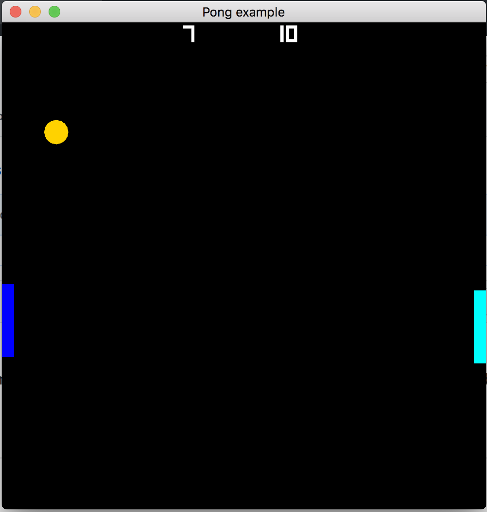

# Examples

All these can be run with
```
cargo run --example name_of_an_example
```

---
### Hello world

Shows the basics of the state machine in `amethyst`.
This example just prints:
```
Begin!
Hello from Amethyst!
End!
```

### Window

Open a window, and create a render context. Also shows basic raw input handling.


### Sphere

Render a basic 3D scene, with a camera, lights and a 3D object, a sphere in this scenario.
This example use a single vertex buffer with all attributes interleaved.


### Separate sphere

Render a basic 3D scene, with a camera, lights and a 3D object, a sphere in this scenario.
This example use vertex buffers per attribute.


### Multisample sphere

Render a basic 3D scene, with a camera, lights and a 3D object, a sphere in this scenario.
This example use vertex buffers per attribute.
Only difference here is that multisampling is enabled in the options.


### Renderable

Load graphics objects from disc using the asset loader.
Also contains a custom system that move the camera and the scene.


### Asset custom

Load a custom asset using a custom format.

### Asset loading

Create a custom format, and use the asset loader to load assets using the format.


### Material

Render a sphere using a physically based material.


### Animation

Animate a sphere using a custom built animation sampler sequence. Keybindings:

* `Space` - start/pause/unpause the currentanimation(default is translational animation)
* `D` - demonstrate deferred start, translate will run first, then rotate when translate ends, and last scale animation 
        will start after rotation has run for 0.66s.
* `T` - set translate to current animation
* `R` - set rotate to current animation
* `S` - set scale to current animation
* `H` - run animation at half speed
* `F` - run animation at full speed
* `V` - run animation at no speed, use stepping keys for controlling the animation
* `Right` - step to the next animation keyframe
* `Left` - step to the previous animation keyframe 

### Gltf

Load a GLTF asset, attach it to an entity, and animate the asset. Press `Space` to start/pause the animation.


### UI

Render a basic UI.


### Pong

`Amethyst` based Pong clone. In addition to using most of the features used by the other examples it also demonstrates:

* Input handling using `InputHandler`
* Background music and sound effects
* A more interesting UI example
* A bigger project with more than a single source file.


### Appendix A

From the book, it is a minor update to the Pong example that uses `Config` files instead of hardcoded constants.



### Custom Game Data

Demonstrates how to use custom `GameData`, with three different states: `Loading`, `Main`, `Paused`.


### Fly Camera

This example shows how to use the Fly Camera.

### Arc ball Camera

This example shows how to use the Arc Ball Camera.

### Sprites Ordered

Draws sprites ordered by Z coordinate. Entities with larger Z coordinates will have their sprites drawn in front of entities with smaller Z coordinates.

This example also demonstrates the use of the `Transparent` component, the depth buffer, and
camera depth values.

Keybindings:

* `T` - Toggle whether the `Transparent` component is attached to entities.
* `R` - Reverse the Z coordinates of the entities.
* `Up` - Increase the Z coordinate of the camera.
* `Down` - Decrease the Z coordinate of the camera.
* `Right` - Increase the depth (Z distance) that the camera can see.
* `Left` - Decrease the depth (Z distance) that the camera can see.

### Prefab

Shows how to load data using the `Prefab` system.

### Prefab Basic

Shows how to create a trivial `PrefabData` and instantiate an entity using the `Prefab` system.

### Prefab Multi

Shows how to create a `PrefabData` and instantiate an entity with multiple components using the `Prefab` system.

### Prefab Custom

Shows how to create a `PrefabData` and instantiate multiple entities with different components using the `Prefab` system.
