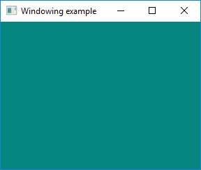
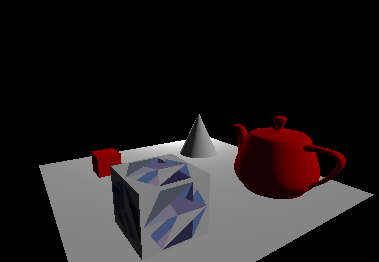
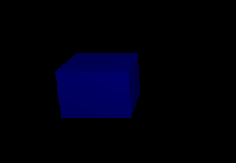
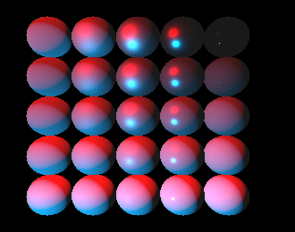
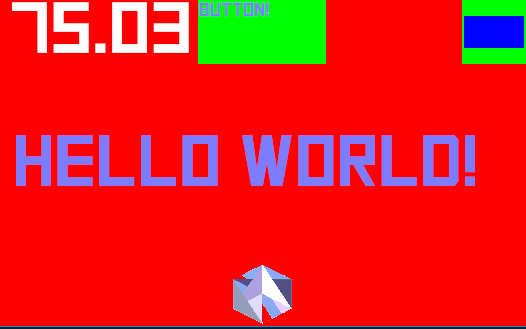
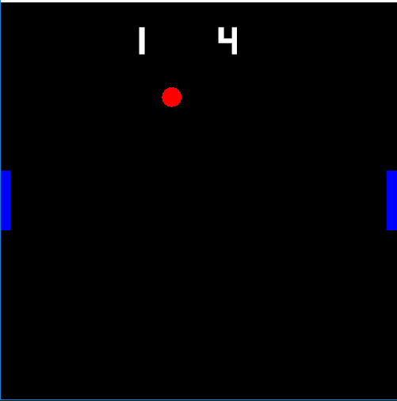

# Examples

All these can be run with
```
cargo run --example name_of_an_example
```

---
### Hello world

Shows the basics of the state machine in `amethyst`.
This example just prints:
```
Begin!
Hello from Amethyst!
End!
```

### Window

Open a window, and create a render context. Also shows basic raw input handling.



### Sphere

Render a basic 3D scene, with a camera, lights and a 3D object, a sphere in this scenario.
This example use a single vertex buffer with all attributes interleaved.


### Separate sphere

Render a basic 3D scene, with a camera, lights and a 3D object, a sphere in this scenario.
This example use vertex buffers per attribute.


### Renderable

Load graphics objects from disc using the asset loader.
Also contains a custom system that move the camera and the scene.



### Asset loading

Create a custom asset format, and use the asset loader to load assets using the format.



### Material

Render a sphere using a physically based material.



### Animation

Animate a sphere using a custom built animation sampler sequence. Press `Space` to start the animation.

### Gltf

Load a GLTF asset, attach it to an entity, and animate the asset. Press `Space` to start/pause the animation.


### UI

Render a basic UI.



### Pong

`Amethyst` based Pong clone. In addition to using most of the features used by the other examples it also demonstrates:

* Input handling using `InputHandler`
* Background music and sound effects
* A more interesting UI example
* A bigger project with more than a single source file.



### Appendix A
From the book, it is a minor update to the Pong example that uses `Config` files instead of hardcoded constants.
