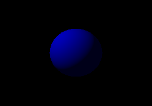

# Examples

All examples can be run with the following command, where `{{name}}` is the name of the example, and `{{backend}}` is your graphics backend (usually `metal` on MacOS and `vulkan` on everything else.) Note that some examples require the additional `gltf` feature.

```
cargo run --example {{name}} --features "{{backend}}"
```

---

## Table of Contents

1. Basic
   1. [Hello World](#hello-world)
   2. [Window](#window)
   3. [Custom Game Data](#custom-game-data)
   4. [Events](#events)
   5. [State Dispatcher](#state-dispatcher)
2. Rendering
   1. [Sphere](#sphere)
   2. [Spotlights](#spotlights)
   3. [Sprites Ordered](#sprites-ordered)
   4. [Renderable](#renderable)
   5. [rendy](#rendy)
3. Assets
   1. [Asset Custom](#asset-custom)
   2. [Asset Loading](#asset-loading)
   3. [Material](#material)
   4. [Animation](#animation)
   5. [GLTF](#gltf)
   6. Prefabs
      1. [Prefab Adapter](#prefab-adapter)
      2. [Prefab Basic](#prefab-basic)
      3. [Prefab Multi](#prefab-multi)
      4. [Prefab Custom](#prefab-custom)
4. UI
   1. [UI](#ui)
   2. [Custom UI](#custom-ui)
5.  Debugging
    1.  [Debug Lines](#debug-lines)
    2.  [Debug Lines Ortho](#debug-lines-ortho)
6.  Networking
    1.  [Net Client](#net-client)
    2.  [Net Server](#net-server)
7. Miscellaneous
   1. [Fly Camera](#fly-camera)
   2. [Arc ball Camera](#arc-ball-camera)
   3. [Auto FOV](#auto-fov)
   4. [Sprite Camera Follow](#sprite-camera-follow)
   5. [Locale](#locale)
8. Games
   1. [Pong](#pong)

# Basic

## Hello World

Basic state machine in Amethyst. Prints the following:

```
Begin!
Hello from Amethyst!
End!
```

---

## Window

Opens a window and creates a render context. Additionally, shows basic raw input handling.


---

## Custom Game Data

Uses `GameData`, with three different states: `Loading`, `Main`, `Paused`.


---

## Events

Sends and recieves the events `A, B, C`.

---

## State Dispatcher

Game state with a dispatcher. This is useful when only certain systems need to be registered per state.

---

# Rendering

## Sphere

Renders a basic sphere.



---

## Spotlights

Displays colored spotlights on a plane.


---

## Sprites Ordered

Draws sprites ordered by Z coordinate. Entities with larger Z coordinates will have their sprites drawn in front of entities with smaller Z coordinates.

This example also demonstrates the use of the `Transparent` component, the depth buffer, and
camera depth values.

Keybindings:

* `T` - Toggle whether the `Transparent` component is attached to entities.
* `R` - Reverse the Z coordinates of the entities.
* `Up` - Increase the Z coordinate of the camera.
* `Down` - Decrease the Z coordinate of the camera.
* `Right` - Increase the depth (Z distance) that the camera can see.
* `Left` - Decrease the depth (Z distance) that the camera can see.


---

## Renderable

Loads graphics objects from disk using the asset loader. Contains a custom system that moves the camera and scene.


---

## Rendy

Showcases the different capabilities of Amethyst's rendy renderer.


---

# Assets

## Asset custom

Loads a custom asset using a custom format.

---

## Asset loading

Creates a custom format and loads it using the asset loader.


---

## Material

Renders a sphere using a physically based material.


---

## Animation

Animates a sphere using a custom-built animation sampler sequence. Keybindings:

* `Space` - start/pause/unpause the currentanimation(default is translational animation)
* `D` - demonstrate deferred start, translate will run first, then rotate when translate ends, and last scale animation
        will start after rotation has run for 0.66s.
* `T` - set translate to current animation
* `R` - set rotate to current animation
* `S` - set scale to current animation
* `H` - run animation at half speed
* `F` - run animation at full speed
* `V` - run animation at no speed, use stepping keys for controlling the animation
* `Right` - step to the next animation keyframe
* `Left` - step to the previous animation keyframe


---

## GLTF

Loads a GLTF asset, attaches it to an entity, and animates the asset. Press `Space` to start/pause the animation.


---

# Prefabs

## Prefab Adapter

Creates a `PrefabData` using the adapter pattern.

---

## Prefab Basic

Creates a trivial `PrefabData` and instantiates an entity using the `Prefab` system.

---

## Prefab Multi

Creates a `PrefabData` and instantiates an entity with multiple components using the `Prefab` system.

---

## Prefab Custom

Create a `PrefabData` and instantiates multiple entities with different components using the `Prefab` system.

---

# UI

## UI

Renders a basic UI.


---

## Custom UI

Renders a custom UI.


---

# Debugging

## Debug Lines

Renders debug lines with a 3D perspective. 


---

## Debug Lines Ortho

Renders debug lines with a 2D orthographic perspective. 


---

# Networking

## Net Client

Client application using laminar.

---

## Net Server

Server application using laminar.

---

# Miscellaneous

## Fly Camera

Shows the Fly Camera. Captures and releases mouse input.


---

## Arc ball Camera

Shows the Arc Ball Camera.


---

## Auto FOV

Adjusts FOV based on render resolution.


---

## Sprite Camera Follow

Camera follows an entity with sprites.


---

## Locale

Shows basic localization for strings used in a game. Prints the following:

```
Hello, world!
See you later!
Bonjour!
Au revoir!
```

---

# Games

## Pong

`Amethyst` based Pong clone. In addition to using most of the features used by the other examples, it also demonstrates:

* Input handling using `InputHandler`
* Background music and sound effects
* A more interesting UI example
* A larger, multi-file project


---