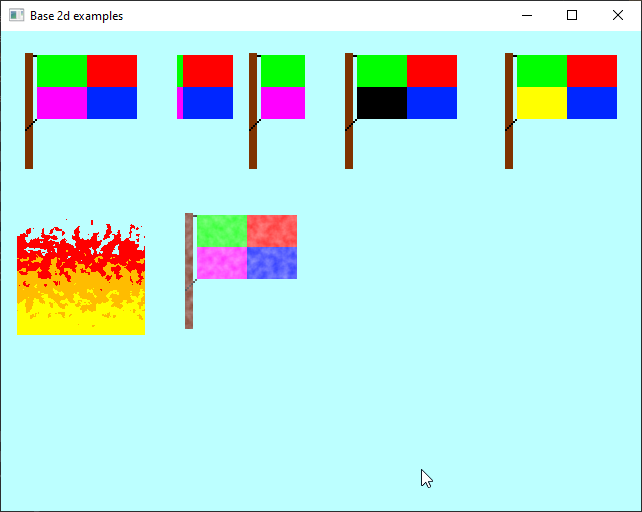

## Custom Render Pass

Showcases a few different effects that can be acheived be extending base_2d pass.

Effects:
* Top Row
    * Flat 2d 
    * Scrolling
    * Color Replace  ( Magenta -> Black)
    * Color Replace  ( Magenta -> Yellow)
* Bottom Row
    * Fire Effect
    * Multitexture Blend
    * Nothing (Saved for future effects)
    * Nothing (Saved for future effect)

