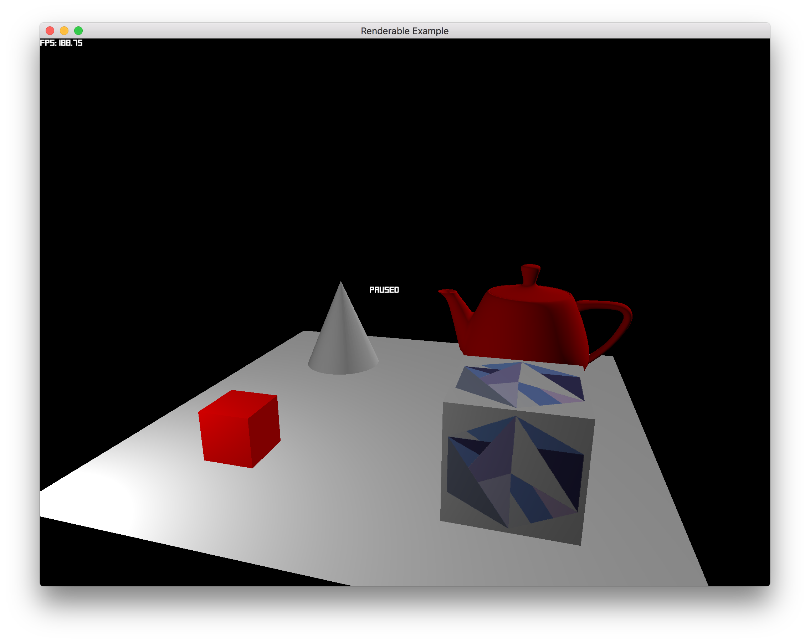

## Custom Game Data

Uses `GameData`, with three different states: `Loading`, `Main`, `Paused`.  Until the assets are loaded, the game will be in the `Loading` state and a corresponding message will be shown on the screen. Once the assets are loaded the `Main` state will be entered. The `Pause` state can then be toggled by pressing the spacebar.

Keybindings:

- `Space` - Toggle the `Pause` state
- `Esc` - Quit

