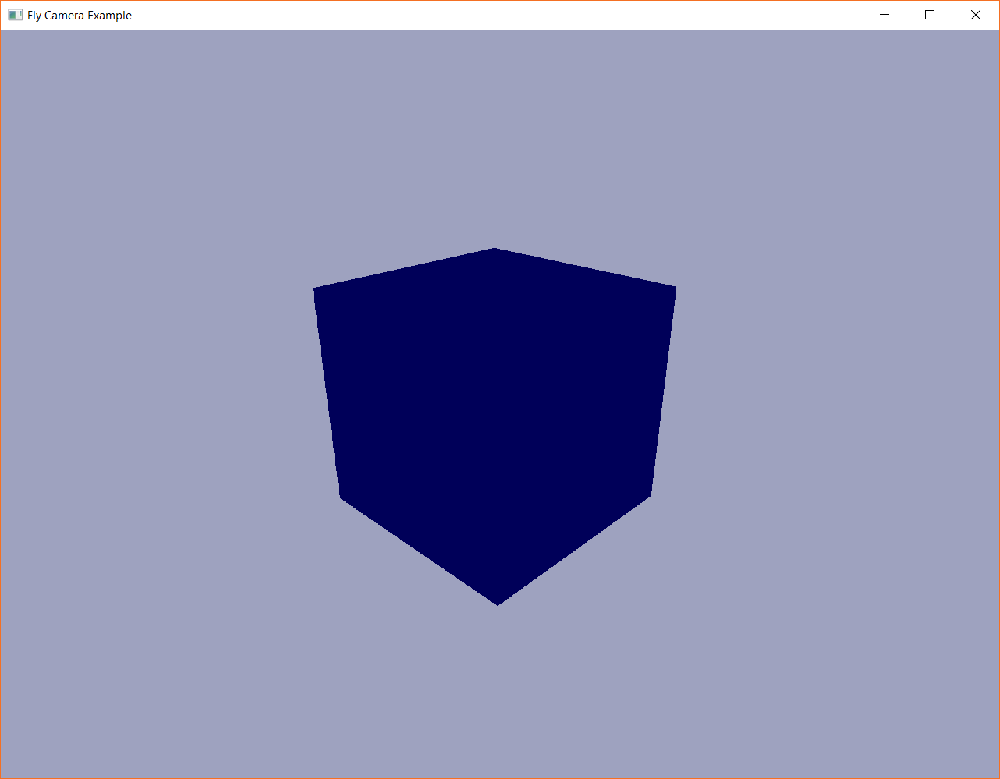

## Fly Camera

Shows the Fly Camera. Captures and releases mouse input.

Keybindings:

- `w` - Fly the camera forward
- `a` - Fly the camera left
- `s` - Fly the camera backward
- `d` - Fly the camera right
- `Esc` - Release the mouse cursor (click on the window again to re-capture it)
- `mouse` - Move the mouse to rotate the camera

