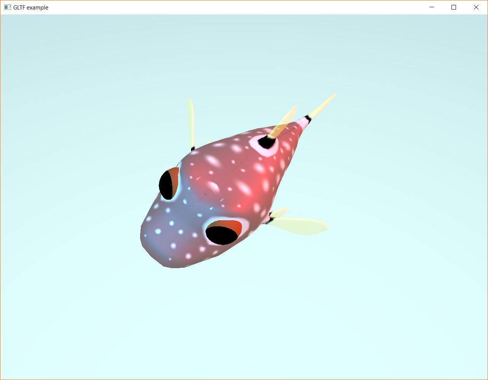

## GLTF

Loads a GLTF asset, attaches it to an entity, and animates the asset.  It may take a few moments after the window appears before the fish appears.

This example requires enabling the `animation` and `gltf` features.

Keybindings:

* `space` - Begin the next animation, 8 in total.
* `mouse` - Mouse movement will rotate the view

