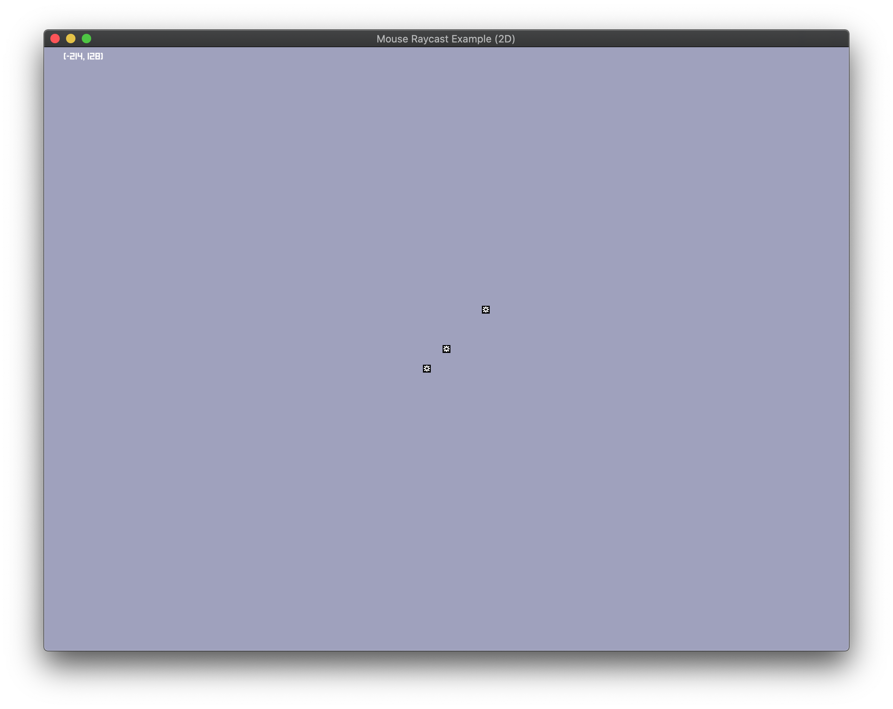

## Mouse raycast 2D

Demonstrates how to perform raycasts with the camera to project from mouse to 2D world coordinates.

Place your mouse cursor over a sprite to identify it.  The sprite label will be displayed in the top left corner of the screen.

