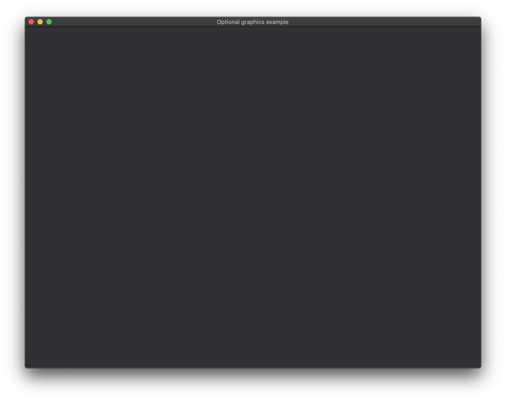

## Optional graphics

This example shows how to easily write an app that can be ran in both graphic and non-graphic mode, with the decision
delegated to the code based on whether "empty" was used as a feature. Handy for applications which want to support
raw-console mode.

It borrows most of the code from the [window](../window) example.

Keybindings:

- `Esc` or `q` - Quit in graphic mode.  For non-graphic mode there will be no window, so press `ctrl-c` in the terminal to terminate the example.

