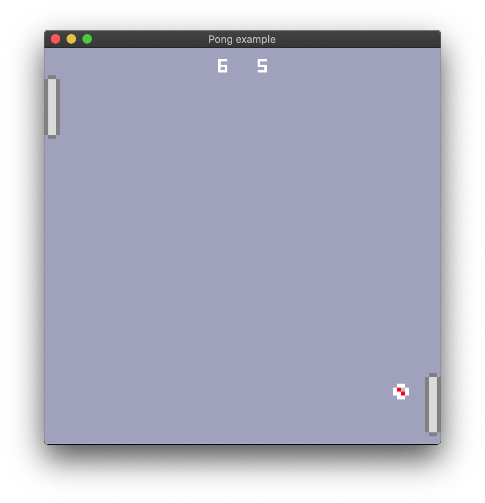

## [Pong Tutorial: Adding audio](https://book.amethyst.rs/master/pong-tutorial/pong-tutorial-06.html)

`Amethyst`-based Pong clone. In addition to using most of the features used by the other examples, it also demonstrates:

- Background music and sound effects
- A larger, multi-file project using bundle

