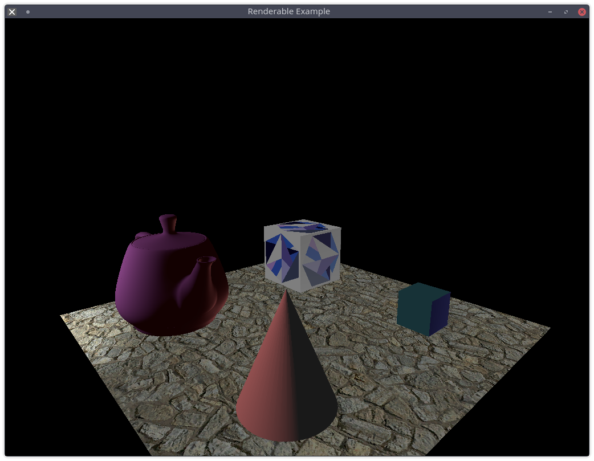

## Renderable (Custom)

Demonstrates how to load renderable objects, along with several lighting methods.

This particular example use a custom `RenderGraph`.

Keybindings:

- `r` - Set the point light to a reddish hue
- `g` - Set the point light to a greenish hue
- `b` - Set the point light to a bluish hue
- `w` - Set the point light to white
- `p` - Toggle the point light between black (off) and white
- `a` - Toggle a dim, white (0.1, 0.1, 0.1) ambient light on and off
- `d` - Toggle a dim, white (0.2, 0.2, 0.2) directional light on and off (it is pointing upwards in the scene)

