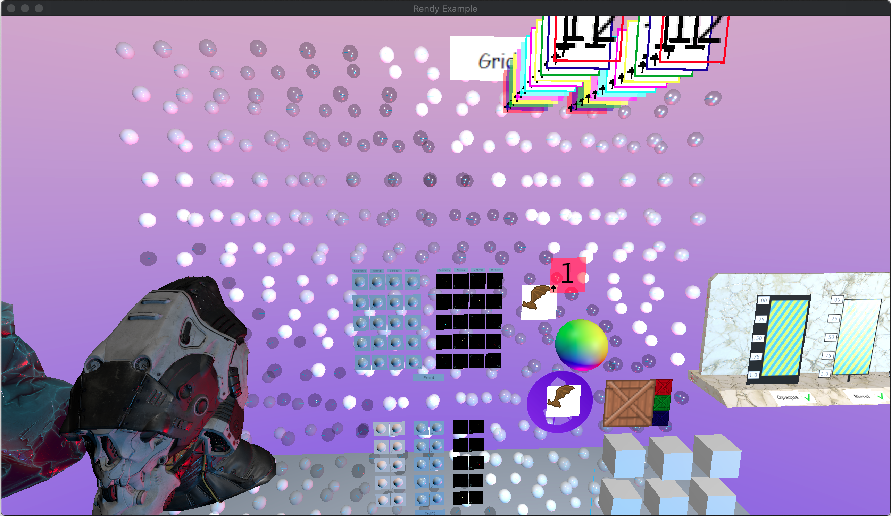

## Rendy

Showcases the different capabilities of Amethyst's rendy renderer. Note that it may take a long time
for many of the objects (cube, helmet, etc.) to load into the scene.

Keybindings:

- `Left Shift` - Slow time to "bullet time" while pressed.
- `Mouse` - Mouse movement rotates the camera
- `wasd` - Forward (w), backward (s), strafe left (a), strafe right (d)
- `Space` - Toggle cube animations.
- `e` - Cycle through render modes: Shaded, Pbr, Flat.

