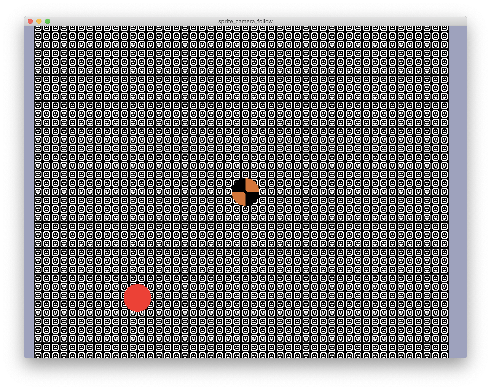

## Tiles

Showcases the `amethyst_tiles` crate.

### Controls

- `WASD` to move the camera on the x and y axis
- `RF` to move the camera on the z axis
- `QE` to change the scale
- `space` to toggle the camera between 2d and 3d
- `Y` to toggle automatic rotation of the tilemap
- `T` to toggle automatic translation of the tilemap

